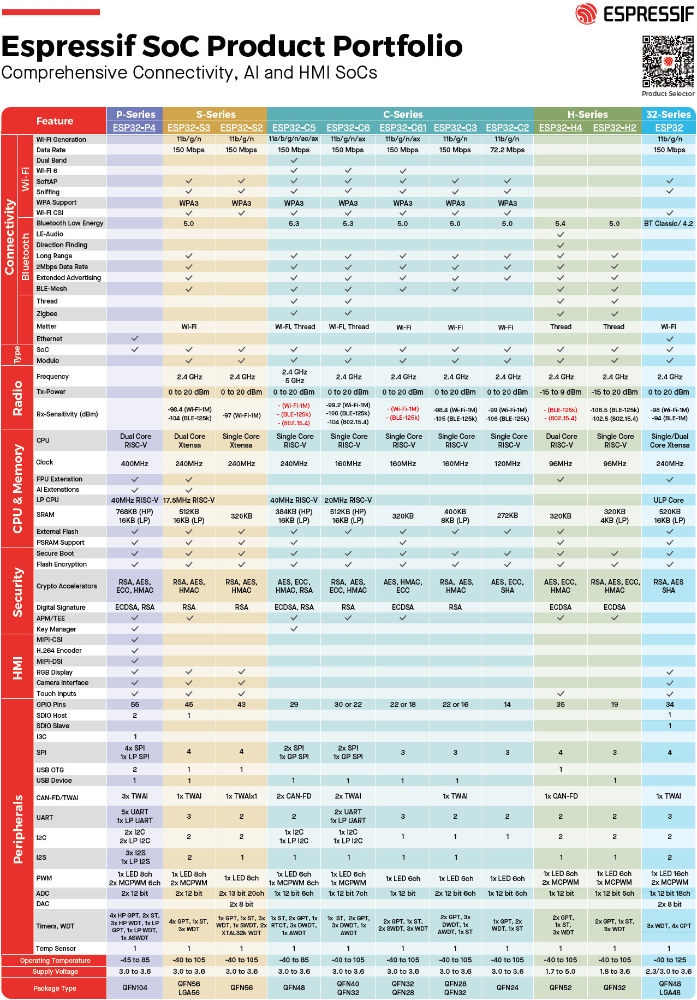

# ESP32Features
Welcome to ESP32Features, a guide and repository for the current ESP32 SoC family from Espressif Systems. This README provides an overview table of the relevant ESP32 models, based on the official Espressif datasheets and documentation (as of September 2025). The ESP32 series includes a wide range of microcontrollers optimized for IoT applications, edge computing, low-power sensors, and industrial systems—from legacy all-rounders like the classic ESP32 to modern RISC V-based chips with Wi-Fi 6, Bluetooth 5.3, and multi-protocol support (e.g., Zigbee/Thread for Matter-compatible smart homes).

## Why ESP32Features?

- **Complete coverage:** All models (ESP32, S2, S3, C3, C2, C5, C6, C61, H2, H4, P4) with a focus on architecture, memory (SRAM, Flash, PSRAM), radios, interfaces, and low-power features.
- **Practical analysis:** Supplemented by deep sleep details, pros and cons, application evaluations, and combination suggestions for hybrid systems (e.g., P4 + C6 for Industry 4.0).
- **Up-to-date & source-based:** Based on Espressif's Product Selector and datasheets (e.g., ESP32-C5 in mass production since 2025, ESP32-C6 with PSA Level 2 security certification).
- **For developers:** Integrated with ESP-IDF, Arduino, and tools for rapid prototyping – ideal for smart devices, AI edge, and IIoT.

The table below summarizes the core features. For detailed analyses, see the subsections: [Espressif SoC Product Portfolio](#espressif-soc-product-portfolio), [Deep Sleep](#deep-sleep), [Advantages and Disadvantages](#thorough-evaluation-of-each-model), [Applications](#list-of-typical-applications), and [Combinations](#useful-combinations-of-esp32-models).

## Overview table of ESP32 models

| Model | Architecture (cores, Clock min/max, LP/ULP) | Embedded SRAM | Embedded Flash/PSRAM options (combos) | Max PSRAM (embedded/external, Future) | Max Flash (embedded/external, Future) | Radio (variants) | Interfaces (selection: number, type) |
|------------|--------------------------------------------|---------------|----------------------------------------|---------------------------------------|---------------------------------------|--------------------------------------------|-----------------------------------|
| ESP32 | Dual Xtensa LX6, 80-240 MHz, no dedicated LP; ULP co-proc (FSM-based, for deep sleep) | 520 KB | Flash: 0/2/4 MB; PSRAM: 0/2 MB; Combos: e.g., U4WDH (2 MB Flash + 0 PSRAM), D0WDR2-V3 (4 MB flash + 2 MB PSRAM) | 2 MB embedded / 8 MB external | 4 MB embedded / 16 MB external | Wi-Fi 2.4 GHz (802.11 b/g/n), BT 4.2 (BR/EDR + LE) | 34 GPIOs; 4 SPI; 2 I2S; 2 I2C; 3 UART; Ethernet MAC; TWAI (CAN); ADC (18 ch., 12-bit); Touch (10); DAC (2, 8-bit) |
| ESP32-S2 | Mono Xtensa LX7, 40-240 MHz, no dedicated LP; ULP co-procs (RISC-V + FSM, not simultaneous) | 320 KB + 16 KB RTC | Flash: 0/2/4 MB; PSRAM: 0/2 MB; Combos: e.g. FH2 (2 MB flash + 0 PSRAM), FN4R2 (4 MB flash + 2 MB PSRAM), R2 (0 flash + 2 MB PSRAM) | 2 MB embedded / 1 GB external (typ. 64 MB) | 4 MB embedded / 1 GB external (typ. 128 MB) | Wi-Fi 2.4 GHz (802.11 b/g/n) | 43 GPIOs; 4 SPI; 1 I2S; 2 I2C; 2 UART; USB OTG (FS); LCD (2: SPI/I2S); Camera (DVP 8/16-bit); ADC (20 ch., 12-bit); DAC (2, 8-bit); Touch (14); RMT (4 ch.); LED PWM (8 ch.) |
| ESP32-S3 | Dual Xtensa LX7, 40-240 MHz, no dedicated LP; ULP co-pros (RISC-V + FSM, not simultaneous) | 512 KB + 16 KB RTC | Flash: 0/4/8/16 MB; PSRAM: 0/2/4/8/16 MB; Combos: e.g., FN8 (8 MB Flash + 0 PSRAM) , R2 (0 + 2 MB), R8 (0 + 8 MB), R16V (0 + 16 MB), FH4R2 (4 MB Flash + 2 MB PSRAM), FN4R8 (4 MB Flash + 8 MB PSRAM) | 16 MB embedded / 32 MB external (Future: 64 MB) | 16 MB embedded / 32 MB external (Future: 64 MB) | Wi-Fi 2.4 GHz (802.11 b/g/n), BT 5 (LE) | 45 GPIOs; 4 SPI (2 mem., 2 gen.); 2 I2S; 2 I2C; 3 UART; USB OTG (FS); SD/MMC (2 slots); TWAI; LCD/Camera; ADC (20 ch., 12-bit); Touch (14); MCPWM; RMT; PCNT; LED PWM |
| ESP32-C3 | Mono RISC-V, 40-160 MHz, no dedicated LP/ULP | 400 KB (16 KB cache) | Flash: 0/4 MB; PSRAM: 0 MB; Combos: e.g. C3 (0 Flash + 0 PSRAM), FH4/C3FH4X (4 MB Flash + 0 PSRAM) – PSRAM external only | 0 MB embedded / 8 MB external (Future: 16 MB) | 4 MB embedded / 16 MB external | Wi-Fi 2.4 GHz (802.11 b/g/n), BT 5 (LE) | 22/16 GPIOs; 3 SPI; 1 I2S; 1 I2C; 2 UART; USB Serial/JTAG; TWAI; LED PWM (6 ch.); RMT (4 ch.); ADC (6 ch., 12-bit); Temp sensor |
| ESP32-C2 | Mono RISC-V, 20-120 MHz, no dedicated LP/ULP | 272 KB (16 KB cache) | Flash: 0 MB (external only); PSRAM: 0 MB; Combos: None embedded (e.g., C2FH4: 0 + 0, but modules such as ESP8684 integrate 4 MB Flash external-style) | 0 MB embedded / 8 MB external (Future: 16 MB) | 0 MB embedded / 16 MB external | Wi-Fi 2.4 GHz (802.11 b/g/n), BT 5 (LE) | 14 GPIOs; 2 SPI; 1 I2S; 1 I2C; 2 UART; LED PWM; GDMA; SAR ADC (6 ch.); Temp sensor; USB Serial |
| ESP32-C5 | Dual RISC-V (HP/LP), HP 40-240 MHz / LP 20-48 MHz, dedicated LP yes; no separate ULP | 384 KB HP + 16 KB LP + 320 KB ROM | Flash: 0/4 MB; PSRAM: 0/8 MB; Combos: e.g. B. C5HF4 (4 MB Flash + 0 PSRAM), C5HR8 (0 Flash + 8 MB PSRAM) | 8 MB embedded / 32 MB external (future: 64 MB) | 4 MB embedded / 32 MB external (future: 64 MB) | Wi-Fi dual-band 6 (2.4/5 GHz, 802.11 a/b/g/n/ac/ax), BT LE 5 (Core 6.0), 802.15.4 (Zigbee 3.0 / Thread 1.4) | 29 GPIOs; 3 SPI; 1 I2S; 2 I2C (+1 LP); 3 UART (+1 LP); USB Serial/JTAG; 2 CAN FD; SDIO; LED PWM (6 ch.); MCPWM (6 ch.); RMT (4 ch.); PARLIO; PCNT (4); ADC (6 ch., 12-bit); Temp sensor; Analog Comparator (2 pads) |
| ESP32-C6 | Dual RISC-V (HP/LP), HP 40-160 MHz / LP 20 MHz, dedicated LP yes; no separate ULP | 512 KB HP + 16 KB LP | Flash: 0/4/8 MB; PSRAM: 0 MB; Combos: e.g. C6 (0 + 0), C6FH4 (4 MB flash + 0), C6FH8 (8 MB flash + 0) – PSRAM external only | 0 MB embedded / 16 MB external (Future: 32 MB) | 8 MB embedded / 16 MB external (Future: 32 MB) | Wi-Fi 6 2.4 GHz (802.11 ax/b/g/n), BT 5.3 (LE + Mesh), 802.15.4 (Zigbee 3.0 / Thread 1.3) | 30/22 GPIOs; 3 SPI; 1 I2S; 2 I2C (+1 LP); 3 UART (+1 LP); USB Serial/JTAG; 2 TWAI; SDIO; LED PWM (6 ch.); MCPWM (3); RMT (4 ch.); PARLIO; PCNT (4); ADC (7 ch., 12-bit); Temp sensor; GDMA; ETM |
| ESP32-C61 | Mono RISC-V, 40-160 MHz, LP/ULP ja (Power Modes) | 320 KB | Flash: 0/4 MB; PSRAM: 0/2/8 MB; Kombos: z. B. C61HF4 (4 MB Flash + 0 PSRAM), C61HR2 (0 Flash + 2 MB PSRAM), C61HR8 (0 Flash + 8 MB PSRAM) – Quad SPI | 8 MB embedded / 32 MB external (Future) | 4 MB embedded / 32 MB external (Future) | Wi-Fi 6 2.4 GHz (802.11 ax), BT 5 (LE) | 30 GPIOs; 2 SPI; 1 I2S; 1 I2C; 3 UART; USB Serial/JTAG; SDIO 2.0 Slave; LED PWM; RMT; TWAI; ADC (1 ch., 12-bit); Temp sensor | 
| ESP32-H2 | Mono RISC-V, 32 MHz (min typ. low-power) / 96 MHz, no dedicated LP/ULP; LP components for deep sleep | 320 KB HP + 4 KB LP | Flash: 0/2/4 MB; PSRAM: 0 MB; Combos: e.g. H2FH2S (2 MB Flash + 0 PSRAM), H2FH4S (4 MB Flash + 0 PSRAM) – PSRAM external only | 0 MB embedded / 16 MB external (Future: 32 MB) | 4 MB embedded / 16 MB external (Future: 32 MB) | BT LE 5. 3 (1/2 Mbps, Coded PHY, Long Range, Advertising Extensions), 802.15.4 (250 Kbps OQPSK, Thread/Zigbee 3.0/Matter) | 19 GPIOs; 2 SPI (Flash + gen.); 2 UART; 2 I2C; 1 I2S; RMT (2 tx/2 rx ch.); LED PWM (6 ch.); USB Serial/JTAG; TWAI (CAN); GDMA (3 tx/3 rx); PCNT; MCPWM; ADC (5 ch., 12-bit); Temp sensor; Timers (2 gen. 54-bit, 52-bit sys., 3 WDT) |
| ESP32-H4 | Dual RISC-V, 96 MHz max, dedizierte LP ja (selective peripherals) | 320 KB | Flash: 0 MB; PSRAM: 0/4 MB; Kombos: z. B. H4 (0 Flash + 0 PSRAM), H4R4 (0 Flash + 4 MB PSRAM) – external Flash support | 0 MB embedded / 4 MB external (Future: 16 MB) | 0 MB embedded / 16 MB external (Future) | BT LE 5.4 (LE), 802.15.4 (Zigbee/Thread/Matter) | 35 GPIOs; I2C; I2S; SPI; UART; LED PWM; ADC; Timers; DMA; TWAI; USB OTG; MCPWM; Touch (14); Event Task Matrix | 
| ESP32-P4 | Dual HP + Mono LP RISC-V, HP 40-360 MHz / LP 40 MHz, dedicated LP yes; no separate ULP | 768 KB HP L2MEM + 32 KB LP + 8 KB SPM | Flash: 0 MB; PSRAM: 0/16/32 MB; Combos: e.g. P4NRW16 (0 Flash + 16 MB PSRAM), P4NRW32 (0 + 32 MB PSRAM) | 32 MB embedded / 64 MB external (Future: 128 MB) | 0 MB embedded / 64 MB external (Future: 128 MB) | No integrated radios (MCU-focused, external possible) | 55 GPIOs (16 LP); 4 SPI (+1 LP); 3 I2S (+1 LP); 3 I2C (+1 Analog +1 I3C); 6 UART (5 HP +1 LP); USB HS/FS OTG + Serial/JTAG; Ethernet (10/100 RMII); 3 TWAI; SD/MMC; LED PWM (8 ch.) ; MCPWM (2); RMT (8 ch.); PARLIO; Touch (14); 2 ADC; VAD; Image: JPEG codec, ISP, H.264 encoder, MIPI CSI/DSI (2-lane), LCD/Camera |

### Notes on the table:

- **Architecture:** Takes into account cores (HP/LP), clock ranges, and low-power features (ULP/LP).
- **Memory:** Embedded options with variant combos; max values incl. future support (e.g., up to 128 MB for P4).
- **Radios:** All variants, including multi-protocol (e.g., Wi-Fi 6 for C5/C6, 802.15.4 for C5/C6/H2 for Matter).
- **Interfaces:** Important peripherals with quantities; focused on GPIOs, wireless relevance, and special features (e.g., MIPI for P4).
- **Sources:** Directly from Espressif datasheets; no new models beyond the list (as of 2025, e.g., C5 in mass production; C61/H4 new to the portfolio).

### Espressif SoC Product Portfolio

## Deep sleep

The information is based on the Espressif SoC product portfolio and the official datasheets (as of September 2025). The structure takes into account the specific characteristics of the new models (e.g., C61 as a single-core Wi-Fi 6 low-power, H4 as a dual-core low-power with 802.15.4). Since the exact deep sleep power consumption values for C61 and H4 are not explicitly stated in the portfolio, these are estimated based on similar models (C6/H2) and marked accordingly.

### Details

**All** ESP32 models (ESP32, S2, S3, C3, C2, C5, C6, C61, H2, H4, P4) support deep sleep mode, and in most cases, special memory (RTC SRAM or comparable) can be used to back up data during deep sleep. However, there are differences in architecture (RTC SRAM, LP SRAM, or other mechanisms) that affect how and which memory is used for this purpose. 

### Overview: Deep sleep and memory for backing up data

**Deep sleep mode:** All models can enter deep sleep, which shuts down the main processor (HP core) and most peripherals to save power. Certain memory areas remain active to back up data or perform simple tasks.

**RTC SRAM**: In models without a dedicated LP core (ESP32, S2, S3, some C3), the RTC SRAM is the main memory that remains active in deep sleep to back up data or execute ULP co-processor code.

**LP SRAM**: In models with a dedicated LP core (C5, C6, H4, P4), LP SRAM takes on this role, as the LP core can remain active in deep sleep mode. The H2/C61 has LP SRAM, but without an LP core, for data storage only.

**Special cases:** C2/C3 have small RTC areas (<8 KB) without ULP/LP core, limited. H2/C61 are optimized for ultra-low consumption (approx. 7–10 μA), with LP peripherals. H4 has a dedicated LP core for more flexible low-power tasks.

### Model-specific details

#### ESP32:

- **Deep sleep:** Yes, supported.
- **Memory:** 520 KB SRAM, part of which (not separately specified as “RTC SRAM,” but approx. 8 KB in the RTC domain) remains active in deep sleep. The ULP co-processor (FSM-based) can access it to save data or perform simple tasks.
- **Usage:** Saving variables in the RTC memory area (via RTC memory API), e.g., status data, counters, or sensor values. The ULP can process this data.
- **Limit:** Limited memory compared to newer models; ULP is not as flexible as an LP core.

#### ESP32-S2:

- **Deep sleep:** Yes, supported.
- **Memory:** 16 KB RTC SRAM explicitly in the datasheet, remains active in deep sleep. Two ULP co-pros (RISC-V + FSM, not simultaneous) can access it.
- **Usage:** RTC SRAM can be used for data (e.g., states, configuration data). The RISC-V ULP allows for more complex calculations than the classic ESP32.
- **Limit:** 16 KB is not huge, but sufficient for most sensor or status data.

#### ESP32-S3:

- **Deep sleep:** Yes, supported.
- **Memory:** 16 KB RTC SRAM, remains active in deep sleep. ULP co-pros (RISC-V + FSM) can use this memory.
- **Usage:** Similar to S2, ideal for data such as configurations, sensor values, or small state machines. The ULP RISC-V is programmable for more complex deep sleep logic.
- **Limit:** Like S2, 16 KB RTC SRAM limits the amount of data.

#### ESP32-C3:

- **Deep sleep:** Yes, supported.
- **Memory:** No explicit RTC SRAM, but part of the 400 KB SRAM (approx. 8 KB in the RTC domain, similar to ESP32) remains active in deep sleep. No ULP co-processor, therefore no programming in deep sleep.
- **Usage:** You can save data in the RTC area (via ESP-IDF RTC memory APIs), but without ULP only static storage, no active processing.
- **Limit:** No ULP or LP core limits flexibility; smaller memory area.

#### ESP32-C2:

- **Deep sleep:** Yes, supported.
- **Memory:** No explicit RTC SRAM or LP SRAM. A small RTC area (not quantified in the datasheet, estimated <8 KB) remains active, similar to C3.
- **Usage:** Limited data storage possible in the RTC area (e.g., state variables), but no active processing as there is no ULP or LP core.
- **Limit:** Very limited, as there is no dedicated memory or co-processor.

#### ESP32-C5:

- **Deep sleep:** Yes, supported (HP core off, LP core can remain active).
- **Memory:** 16 KB LP SRAM for the dedicated LP core (RISC-V), remains active in deep sleep. No separate RTC SRAM, as the LP core takes over these tasks.
- **Usage:** LP SRAM can be used for data and code of the LP core running in deep sleep. Ideal for complex low-power logic or data storage.
- **Limit:** 16 KB LP SRAM is sufficient but not huge; LP core offers more flexibility than ULP.

#### ESP32-C6:

- **Deep sleep:** Yes, supported (similar to C5).
- **Memory:** 16 KB LP SRAM for the LP core, remains active in deep sleep. No separate RTC SRAM.
- **Usage:** Like C5, LP SRAM for LP core data/code, suitable for complex deep sleep tasks.
- **Limit:** 16 KB LP SRAM, but more flexible due to LP core.

#### ESP32-C61:

- **Deep sleep:** Yes, supported (optimized for low-power Wi-Fi 6, est. ~10 μA).
- **Memory:**  4 KB LP SRAM, remains active in deep sleep. No separate RTC SRAM or dedicated LP core.
- **Usage:** LP SRAM for passive data storage (e.g., state variables, sensor data) in deep sleep; LP peripherals (e.g., timers, ADC) support simple tasks.
- **Limit:** 4 KB LP SRAM is small; no LP core, therefore no complex processing in deep sleep.

#### ESP32-H2:

- **Deep sleep:** Yes, supported (optimized for ultra-low consumption, 7 μA).
- **Memory:** 4 KB LP SRAM, remains active in deep sleep. No separate RTC SRAM or dedicated LP core.
- **Usage:** LP SRAM for passive data storage (e.g., state variables, sensor data) in deep sleep; LP peripherals (e.g., timers, sensors) support simple tasks.
- **Limit:** 4 KB LP SRAM is small; no LP core, therefore no complex processing in deep sleep.

#### ESP32-H4:

- **Deep sleep:**  Yes, supported (optimized for ultra-low consumption with selective peripherals, est. ~7 μA).
- **Memory:** 16 KB LP SRAM for the LP core, remains active in deep sleep. No separate RTC SRAM.
- **Usage:** LP SRAM for LP core data/code, suitable for complex deep sleep tasks (e.g., Mesh-Networking, sensor processing).
- **Limit:** 16 KB LP SRAM, but flexible due to dedicated LP core.

#### ESP32-P4:

- **Deep sleep:** Yes, supported (HP cores off, LP core active).
- **Memory:** 32 KB LP SRAM for the LP core, remains active in deep sleep. No RTC SRAM, as LP core takes over low-power tasks.
- **Usage:** LP SRAM for LP core data and code, ideal for demanding low-power applications (e.g., image processing, sensor logic).
- **Limit:** 32 KB is more generous than C5/C6, no significant limitations.

### Summary

- **All** ESP32 models support deep sleep.
- **RTC memory** (or equivalent) for data backup on all models
- **ESP32, S2, S3:** RTC SRAM (16 KB on S2/S3, smaller range on classic ESP32) for data storage, supported by ULP co-pros.
- **C3, C2:** Small RTC area (not explicitly specified, <8 KB), only for static data storage, no ULP/LP core.
- **C5, C6, H2, P4:** LP SRAM (16 KB for C5/C6, 32 KB for P4) for data storage and LP core tasks, more flexible than RTC SRAM.
- **Differences:** Models with ULP (ESP32, S2, S3) or LP core (C5, C6, H2, P4) offer more flexibility as they can actively execute code in deep sleep. C3 and C2 are limited (storage only, no processing).
- **C5, C6, H2, P4** can also use the LP core to be active **in deep sleep**.

## Thorough evaluation of each model

Based on the official Espressif datasheets (as of September 2025) and the details collected from the sources, each ESP32 model is analyzed in terms of its advantages and disadvantages. The focus is on **key usability**, i.e., how the features (architecture, memory, radios, interfaces, power) optimize the model for specific areas of application. The evaluation takes into account factors such as performance, energy efficiency, cost, compatibility (e.g., RISC-V vs. Xtensa), wireless options, and peripherals. Models with RISC-V are future-oriented (better for open source), while Xtensa is established. Newer models (C series, H2, P4) emphasize low power and multi-protocol (e.g., Matter), while older models (Classic, S2, S3) are more general but consume more power.

#### ESP32
- **Focus**: All-rounder for wireless networks and legacy applications; strong in Wi-Fi + BT Classic/LE combinations with Ethernet/CAN.
- **Advantages**: Dual-core Xtensa for parallel tasks (e.g., Wi-Fi + BT), established ecosystem (lots of code available), Ethernet MAC and TWAI (CAN) for industrial networks, inexpensive and robust, ULP co-proc for simple low-power tasks.
- **Disadvantages**: Higher power consumption (deep sleep ~10 μA, active >100 mA), Xtensa architecture less forward-looking (fewer open-source tools), no Wi-Fi 6/BT 5, limited memory options (max 4 MB embedded flash), outdated (NRND for some variants), no dedicated LP core.
- **Overall rating**: Good for cost-effective, established projects with mixed connectivity, but not ideal for ultra-low-power or modern protocols.

#### ESP32-S2
- **Focus**: USB and multimedia-focused (LCD/camera/touch), for Wi-Fi-only devices with low power.
- **Advantages**: USB OTG (FS) for HID/storage, LCD/camera interfaces for displays, 14 touch sensors, ULP co-pros (RISC-V + FSM) for flexible deep sleep, large external memory support (up to 1 GB), compact and energy-efficient for Wi-Fi apps.
- **Disadvantages**: No BT, mono-core Xtensa (less performance), no Ethernet/CAN, touch not CS-certified (restrictions in noisy environments), higher consumption than C series (deep sleep ~5-7 μA), outdated compared to S3.
- **Overall rating**: Strong for USB-based or display/touch devices (e.g., smart panels), but limited without BT/multi-core.

#### ESP32-S3
- **Focus**: AI and multimedia (vector/AI extensions, LCD/camera), for edge computing with Wi-Fi/BT LE.
- **Advantages**: Dual-core Xtensa with AI/DSP extensions (e.g., 128-bit vector), USB OTG/SD for storage, LCD/camera for video, ULP co-pros for low power, large memory (up to 16 MB embedded PSRAM), BT 5 LE for modern apps.
- **Disadvantages**: No Wi-Fi 6, higher power consumption (deep sleep ~7 μA, active >100 mA), Xtensa instead of RISC-V, ADC/Wi-Fi conflicts, more expensive than C series, no 802.15.4.
- **Overall rating* *: Ideal for AI/multimedia (e.g., voice/image recognition), but not optimal for ultra-low-power or multi-protocol IoT.

#### ESP32-C3
- **Focus**: Low-cost, low-power wireless (Wi-Fi + BT LE) for simple sensors.
- **Advantages**: RISC-V mono-core (forward-looking), Wi-Fi + BT 5 LE, TWAI (CAN), USB serial/JTAG, inexpensive and compact, external memory up to 16 MB.
- **Disadvantages**: No ULP/LP core (limited deep sleep processing, ~5 μA), limited GPIOs (22/16), no Ethernet/USB OTG, mono-core limits performance, some variants EOL/NRND.
- **Overall rating**: Perfect for low-cost, battery-powered sensors, but weak in multimedia/high performance.

#### ESP32-C2
- **Focus**: Ultra-low-cost minimalist for low-power wireless.
- **Advantages**: Very inexpensive and small, RISC-V mono-core, Wi-Fi + BT 5 LE, low power (deep sleep <8 μA), external memory support.
- **Disadvantages**: No embedded flash/PSRAM (external only), few GPIOs (14), minimal interfaces (no USB OTG/Ethernet/CAN), no ULP/LP core, limited SRAM (272 KB).
- **Overall rating**: For mass-produced, simple wireless devices (e.g., tags), but too limited for complex apps.

#### ESP32-C5
- **Focus**: Modern multi-protocol wireless (dual-band Wi-Fi 6 + BT LE 5 + 802.15.4), for low-power IoT with LP core.
- **Advantages**: Dual-band Wi-Fi 6 (2.4/5 GHz), BT LE 5 (incl. direction finding), 802.15.4 (Zigbee/Thread), dedicated LP core (RISC-V, up to 48 MHz), CAN FD, low power (deep sleep ~12 μA), RISC-V dual core.
- **Disadvantages**: Fewer GPIOs (29), limited embedded memory (4 MB flash/8 MB PSRAM), higher price, new (less established).
- **Overall rating**: Strong for smart home/IoT networks (Matter-compatible), but not for high performance without wireless.

#### ESP32-C6
- **Focus**: Low-power multi-protocol (Wi-Fi 6 2.4GHz + BT 5.3 + 802.15.4), for battery-powered IoT with LP core.
- **Advantages**: Wi-Fi 6 (2.4 GHz), BT 5.3 (mesh), 802.15.4 (Zigbee/Thread), dedicated LP core (RISC-V, 20 MHz), low power (deep sleep 7 μA), RISC-V dual-core, TWAI.
- **Disadvantages**: No 5 GHz Wi-Fi, limited embedded PSRAM (external only), 30/22 GPIOs, no USB OTG/Ethernet.
- **Overall rating**: Ideal for energy-efficient smart devices (e.g., sensor networks), better than C5 in terms of power, but without dual band.

#### ESP32-H2
- **Focus**: Ultra-low-power non-Wi-Fi wireless (BT LE 5.3 + 802.15.4), for Thread/Zigbee/Matter.
- **Advantages**: BT LE 5.3 (long range, mesh), 802.15.4 (Zigbee/Thread), RISC-V mono-core (96 MHz), ultra-low power (deep sleep 7 μA), USB Serial/JTAG, compact.
- **Disadvantages**: No Wi-Fi, small SRAM (320 KB + 4 KB LP), few GPIOs (19), no dedicated LP core (only LP components), limited interfaces.
- **Overall rating**: Ideal for battery-powered mesh networks (e.g., smart lighting), but unsuitable for Wi-Fi apps.

#### ESP32-P4
- **Focus**: High-performance MCU without radios, for AI/multimedia (JPEG/H.264/MIPI) with wired connectivity.
- **Advantages**: Dual-HP + mono-LP RISC-V (up to 360 MHz), AI/DSP extensions, multimedia (JPEG codec, H.264 encoder, MIPI CSI/DSI), USB HS/FS OTG, Ethernet, 55 GPIOs (16 LP), large memory (up to 32 MB embedded PSRAM), VAD/Touch.
- **Disadvantages**: No integrated radios (external required), no embedded flash, higher power consumption (deep sleep 0.025 mA), more expensive, new (less support).
- **Overall rating**: Perfect for high-performance wired/AI devices (e.g., HMI panels), but not for wireless without add-ons.

## List of typical applications

Below is a list of 35 typical applications for ESP32 models, based on Espressif recommendations (e.g., smart home, IoT, industrial). These cover areas such as low-power sensors, multimedia, AI, industrial, and wearables. The list is numbered and briefly describes the focus.

1. Smart home hub (e.g., central control with multi-protocol).
2. Wi-Fi access point/extender (e.g., network extension).
3. Bluetooth audio device (e.g., speaker/headset).
4. Low-power sensor node (e.g., environmental sensor with battery).
5. AI edge computing (e.g., voice recognition).
6. Security Camera (e.g., video surveillance with streaming).
7. Wearable Fitness Tracker (e.g., pedometer with BT).
8. Industrial IoT Gateway (e.g., data collection with CAN/Ethernet).
9. Zigbee/Thread Smart Lighting (e.g., lamp control) .
10. USB HID Device (e.g., mouse/keyboard).
11. Ethernet-Connected Controller (e.g., wired automation).
12. CAN-Bus Vehicle Monitor (e.g., auto diagnostics).
13. LCD display panel (e.g., HMI interface).
14. Touch screen device (e.g., control panel).
15. Battery-powered remote control (e.g., IR/remote control).
16. Matter-compatible smart plug (e.g., power outlet with multi-protocol).
17. Wi-Fi 6 mesh network (e.g., home mesh).
18. Bluetooth mesh sensor network (e.g., building monitoring).
19. 802.15.4 low-power mesh (e.g., Thread network).
20. Robotics controller (e.g., motor control with PWM).
21. Barcode scanner (e.g., image processing).
22. Voice Assistant (e.g., voice control).
23. Secure IoT Device (e.g., with encryption/boot).
24. Environmental Monitoring Station (e.g., weather station).
25. SD card data logger (e.g., logging with storage).
26. PWM motor driver (e.g., DC motors).
27. Analog sensor reader (e.g., temp/pressure with ADC).
28. Asset tracking tag (e.g., BT LE beacon).
29. Smart Thermostat (e.g., heating control).
30. POS Terminal (e.g., payment terminal with display).
31. Service Robot Brain (e.g., navigation with AI).
32. Audio Streaming Device (e.g., music player).
33. Health monitoring wearable (e.g., pulse sensor).
34. Agricultural sensor (e.g., soil moisture with low power).
35. Vending machine controller (e.g., payment/display).

### Evaluation table

The table evaluates the suitability of each model for the applications with ++ (very good, optimal), + (good, feasible), 0 (neutral, with limitations), - (poor, unsuitable), -- (very poor, impossible). Evaluation is based on features (e.g., radios for wireless, LP core for low power, interfaces for multimedia). Optional text in parentheses explains key reasons.

| Application | ESP32 | ESP32-S2 | ESP32-S3 | ESP32-C3 | ESP32-C2 | ESP32-C5 | ESP32-C6 | ESP32-H2 | ESP32-P4 |
|-----------|-------|----------|----------|----------|----------|----------|----------|----------|----------|
| 1. Smart home hub | ++ (Wi-Fi/BT + Ethernet) | + (Wi-Fi, but no BT) | ++ (AI/multimedia + BT LE) | + (low-cost Wi-Fi/BT) | 0 (minimal, but Wi-Fi/BT) | ++ (Multi-Protocol Wi-Fi 6) | ++ (Wi-Fi 6 + 802.15.4) | + (802.15.4/BT, no Wi-Fi) | + (High-Perf, but external radios) |
| 2. Wi-Fi Access Point/Extender | ++ (Dual-Core Wi-Fi) | ++ (Wi-Fi + USB) | ++ (Wi-Fi + Memory) | + (Low-Power Wi-Fi) | + (Minimal Wi-Fi) | ++ (Dual-Band Wi-Fi 6) | ++ (Wi-Fi 6) | -- (No Wi-Fi) | - (No Radios) |
| 3. Bluetooth Audio Device | ++ (BT Classic/LE) | -- (No BT) | ++ (BT LE + I2S) | + (BT LE) | + (BT LE) | ++ (BT LE 5 + I2S) | ++ (BT 5.3 Mesh) | ++ (BT LE 5.3) | + (I2S/LP, but external BT) |
| 4. Low-Power Sensor Node | + (ULP, but power-intensive) | + (ULP co-pros) | + (ULP co-pros) | ++ (Low-Power RISC-V) | ++ (Ultra-Low-Cost/Power) | ++ (LP core + low power consumption) | ++ (LP core + 7μA deep sleep) | ++ (ultra-low power 7μA) | + (LP core, but no wireless) |
| 5. AI edge computing | + (dual core) | 0 (single core) | ++ (vector/AI extensions) | - (Single-Core, Low SRAM) | -- (Minimal) | + (Dual-Core RISC-V) | + (Dual-Core) | - (Single-Core, Low SRAM) | ++ (AI/DSP Extensions) |
| 6. Security Camera | + (Wi-Fi/BT) | ++ (LCD/Camera + Wi-Fi) | ++ (LCD/Camera + AI) | 0 (No camera interface) | - (Minimal interfaces) | + (Wi-Fi 6, but no camera) | + (Wi-Fi 6) | - (No Wi-Fi/camera) | ++ (MIPI CSI/DSI + H.264) |
| 7. Wearable fitness tracker | + (BT + touch) | + (touch + low power) | ++ (BT LE + touch/AI) | ++ (BT LE + low power) | ++ (low power BT LE) | ++ (BT LE 5 + LP core) | ++ (BT 5.3 + LP core) | ++ (BT LE 5.3 low power) | + (Touch + LP, but large) |
| 8. Industrial IoT Gateway | ++ (Ethernet/CAN + Dual-Core) | + (USB/TWAI) | ++ (TWAI + SD) | + (TWAI + Low-Cost) | 0 (Minimal) | ++ (CAN FD + Multi-Protocol) | ++ (TWAI + Wi-Fi 6) | + (802.15.4 + TWAI) | ++ (Ethernet + CAN) |
| 9. Zigbee/Thread Smart Lighting | 0 (No 802.15.4) | 0 (No 802.15.4) | 0 (No 802.15.4) | 0 (No 802.15.4) | 0 (No 802.15.4) | ++ (802.15.4 + Zigbee/Thread) | ++ (802.15.4 + Thread 1.3) | ++ (802.15.4 + Zigbee/Thread) | - (No radios) |
| 10. USB HID Device | + (UART/USB Serial) | ++ (USB OTG FS) | ++ (USB OTG FS) | + (USB Serial) | + (USB Serial) | + (USB Serial) | + (USB Serial) | + (USB Serial) | ++ (USB HS/FS OTG) |
| 11. Ethernet-Connected Controller | ++ (Ethernet MAC) | - (No Ethernet) | - (No Ethernet) | - (No Ethernet) | - (No Ethernet) | - (No Ethernet) | - (No Ethernet) | - (No Ethernet) | ++ (Ethernet 10/100) |
| 12. CAN bus vehicle monitor | ++ (TWAI/CAN) | + (TWAI) | + (TWAI) | ++ (TWAI) | - (No CAN) | ++ (2x CAN FD) | ++ (2x TWAI) | + (TWAI) | ++ (3x TWAI) |
| 13. LCD Display Panel | + (I2S/SPI) | ++ (LCD Interface) | ++ (LCD/Camera) | 0 (No LCD) | - (Minimal) | 0 (No LCD) | 0 (No LCD) | 0 (No LCD) | ++ (MIPI DSI + LCD) |
| 14. Touch Screen Device | ++ (10 Touch) | ++ (14 Touch) | ++ (14 Touch) | - (No Touch) | - (No Touch) | - (No Touch) | - (No Touch) | - (No Touch) | ++ (14 Touch) |
| 15. Battery-Powered Remote | + (BT + Low-Power) | + (Wi-Fi + RMT) | + (BT LE) | ++ (BT LE Low-Power) | ++ (BT LE Minimal) | ++ (BT LE 5 LP-Core) | ++ (BT 5.3 LP-Core) | ++ (BT LE 5.3 Low-Power) | + (RMT + LP-Core) |
| 16. Matter-Compatible Smart Plug | + (Wi-Fi/BT) | + (Wi-Fi) | + (Wi-Fi/BT LE) | + (Wi-Fi/BT LE) | + (Wi-Fi/BT LE) | ++ (Multi-Protocol) | ++ (Wi-Fi 6 + 802.15.4) | ++ (802.15.4/BT LE) | - (No radios) |
| 17. Wi-Fi 6 Mesh Network | - (No Wi-Fi 6) | - (No Wi-Fi 6) | - (No Wi-Fi 6) | - (No Wi-Fi 6) | - (No Wi-Fi 6) | ++ (Dual-band Wi-Fi 6) | ++ (Wi-Fi 6 2.4GHz) | -- (No Wi-Fi) | - (No radios) |
| 18. Bluetooth Mesh Network | + (BT LE) | -- (No BT) | ++ (BT 5 LE Mesh) | + (BT 5 LE) | + (BT 5 LE) | ++ (BT LE 5) | ++ (BT 5.3 Mesh) | ++ (BT LE 5.3 Mesh) | - (No radios) |
| 19. 802.15.4 Low-Power Mesh | - (No 802.15.4) | - (No 802.15.4) | - (No 802.15.4) | - (No 802.15.4) | - (No 802.15.4) | ++ (802.15.4) | ++ (802.15.4) | ++ (802.15.4) | - (No radios) |
| 20. Robotics Controller | ++ (Dual-core + PWM) | + (Single-core + PWM) | ++ (Dual-Core + MCPWM) | + (Mono-Core + PWM) | 0 (Minimal PWM) | ++ (MCPWM + Dual-Core) | ++ (MCPWM + Dual-Core) | + (MCPWM) | ++ (MCPWM + High-Perf) |
| 21. Barcode Scanner | + (Wi-Fi/BT) | ++ (Camera) | ++ (Camera + AI) | 0 (No Camera) | - (No Camera) | 0 (No Camera) | 0 (No Camera) | 0 (No Camera) | ++ (ISP + MIPI CSI) |
| 22. Voice Assistant | + (Dual-Core + I2S) | + (I2S + USB) | ++ (I2S + AI) | 0 (I2S, but Mono) | 0 (I2S Minimal) | + (I2S + Dual-Core) | + (I2S + Dual-Core) | + (I2S) | ++ (VAD + I2S/LP) |
| 23. Secure IoT Device | ++ (Crypto Accel) | ++ (Crypto + Secure Boot) | ++ (Crypto + Secure Boot) | ++ (Crypto) | + (Crypto) | ++ (Crypto + XTS-AES) | ++ (Crypto + XTS-AES) | ++ (Crypto) | ++ (Crypto + DSA) |
| 24. Environmental Monitoring Station | + (ADC + Wireless) | + (ADC + Touch) | + (ADC + Touch) | ++ (ADC + Low-Power) | ++ (ADC + Low-Power) | ++ (ADC + LP-Core) | ++ (ADC + LP-Core) | ++ (ADC + Low-Power) | + (ADC + Touch) |
| 25. SD Card Data Logger | + (SPI) | + (SPI) | ++ (SD/MMC) | + (SPI) | + (SPI) | ++ (SDIO) | ++ (SDIO) | 0 (No SD) | ++ (SD/MMC) |
| 26. PWM Motor Driver | ++ (PWM) | ++ (LED PWM) | ++ (MCPWM) | ++ (LED PWM) | ++ (LED PWM) | ++ (MCPWM 6 ch.) | ++ (MCPWM 3 ch.) | ++ (LED PWM) | ++ (MCPWM 2) |
| 27. Analog Sensor Reader | ++ (ADC 18 ch.) | ++ (ADC 20 ch.) | ++ (ADC 20 ch.) | ++ (ADC 6 ch.) | ++ (ADC 6 ch.) | ++ (ADC 6 ch.) | ++ (ADC 7 ch.) | ++ (ADC 5 ch.) | ++ (2 ADC) |
| 28. Asset Tracking Tag | + (BT LE) | - (No BT) | + (BT LE) | ++ (BT LE Low-Power) | ++ (BT LE Low-Power) | ++ (BT LE 5 Direction) | ++ (BT 5.3) | ++ (BT LE 5.3 Long Range) | - (No Radios) |
| 29. Smart Thermostat | ++ (Wi-Fi/BT + Touch) | ++ (Wi-Fi + Touch) | ++ (Wi-Fi/BT + Touch) | + (Wi-Fi/BT) | + (Wi-Fi/BT) | ++ (Multi-Protocol) | ++ (Wi-Fi 6 + 802.15.4) | + (802.15.4/BT) | + (Touch, external radios) |
| 30. POS Terminal | + (Ethernet + Display) | ++ (USB + LCD) | ++ (SD + LCD) | 0 (No USB OTG) | - (Minimal) | 0 (No USB OTG) | 0 (No USB OTG) | 0 (No USB) | ++ (USB HS + SD/MMC) |
| 31. Service Robot Brain | ++ (Dual-Core + Ethernet) | + (Mono-Core + USB) | ++ (Dual-Core + AI) | + (Mono-Core) | - (Minimal) | ++ (Dual-Core + CAN) | ++ (Dual-Core) | + (Mono-Core) | ++ (High-Perf + AI) |
| 32. Audio Streaming Device | ++ (I2S + BT) | ++ (I2S + Wi-Fi) | ++ (I2S + BT LE) | + (I2S + BT LE) | + (I2S + BT LE) | ++ (I2S + BT LE 5) | ++ (I2S + BT 5.3) | ++ (I2S + BT LE 5.3) | ++ (I2S/LP + VAD) |
| 33. Health Monitoring Wearable | + (BT + ADC) | + (ADC + Touch) | ++ (BT LE + Touch/AI) | ++ (BT LE + ADC) | ++ (BT LE + ADC) | ++ (BT LE 5 + ADC) | ++ (BT 5.3 + ADC) | ++ (BT LE 5.3 + ADC) | + (ADC + Touch) |
| 34. Agricultural Sensor | + (Wi-Fi/BT + ADC) | + (Wi-Fi + ADC) | + (Wi-Fi/BT + ADC) | ++ (Wi-Fi/BT + Low-Power) | ++ (Wi-Fi/BT + Low-Power) | ++ (Multi-Protocol + ADC) | ++ (Wi-Fi 6 + ADC) | ++ (802.15.4/BT + ADC) | + (ADC, external radios) |
| 35. Vending Machine Controller | ++ (Ethernet + Display) | ++ (USB + LCD/Touch) | ++ (SD + LCD/Touch) | + (SPI) | 0 (Minimal) | + (SDIO) | + (SDIO) | 0 (No SD) | ++ (SD/MMC + Ethernet) |

### Useful combinations of ESP32 models

Based on the previous analyses (architecture, radios, interfaces, advantages/disadvantages, and applications), potential combinations were identified that complement the strengths of the models. For example, a model without radios (e.g., P4) is compensated for by a wireless model (e.g., C6), or a low-power model (e.g., H2) extends a high-performance model (e.g., S3). The focus is on meaningful pairs/trios (not all possible ones, as Classic + S2 would be redundant, for example), prioritizing complementarity (e.g., processing + connectivity). For each combination: description of why it makes sense and applications (simple to demanding, including Industry 4.0 with a focus on edge computing, predictive maintenance, secure gateways, and multi-protocol networks).

#### 1. ESP32-P4 + ESP32-C6
- **Description**: P4 as a high-performance MCU (dual-HP RISC-V up to 360 MHz, AI/DSP, multimedia interfaces such as MIPI CSI/DSI, Ethernet, USB HS) combined with C6 as wireless module (Wi-Fi 6 2.4 GHz, BT 5.3 Mesh, 802.15.4 for Zigbee/Thread, dedicated LP core for low power).
- **Why it makes sense**: P4 lacks radios, C6 complements with multi-protocol wireless and LP core for energy-efficient edge tasks; common RISC-V architecture facilitates software integration (e.g., via SPI/I2C/UART connection).
- **Applications**:
  - Simple: Smart home gateway (P4 for display/USB processing, C6 for Wi-Fi/Thread connectivity).
  - Medium: AR glasses for training (P4 for H.264 encoding/MIPI camera, C6 for BT mesh to sensors).
  - Sophisticated (Industry 4.0): Predictive maintenance system in factories (P4 for edge AI analysis of vibrations/images, C6 for secure wireless transmission to the cloud; enables real-time fault detection in machine networks).

#### 2. ESP32-P4 + ESP32-C5
- **Description**: P4 (high-performance MCU with AI, Ethernet, USB HS/FS, large memory) + C5 (dual-band Wi-Fi 6 2.4/5 GHz, BT LE 5, 802.15.4, LP-Core, CAN FD).
- **Why it makes sense**: C5 offers dual-band Wi-Fi for higher bandwidth (e.g., video streaming), P4 complements with wired connectivity (Ethernet) and multimedia processing; both RISC-V-based for seamless integration.
- **Applications**:
  - Simple: Video doorbell (P4 for JPEG/H.264, C5 for Wi-Fi upload).
  - Medium: Smart factory monitor (P4 for VAD/voice control, C5 for dual-band network).
  - Demanding (Industry 4.0): Robotics control in automation lines (P4 for MCPWM motor control and AI navigation, C5 for CAN FD + Wi-Fi 6 to coordinate multiple robots; supports real-time data aggregation for supply chain optimization).

#### 3. ESP32-S3 + ESP32-C6
- **Description**: S3 (dual Xtensa with AI/vector extensions, LCD/camera, USB OTG, BT 5 LE) + C6 (Wi-Fi 6, BT 5.3, 802.15.4, LP core).
- **Why it makes sense**: S3 brings AI/multimedia, C6 extends to Wi-Fi 6/802.15.4 for better IoT interoperability (e.g., Matter); ULP co-pros from S3 + LP core from C6 for hybrid low-power modes.
- **Applications**:
  - Simple: AI voice assistant (S3 for voice recognition, C6 for mesh connectivity).
  - Medium: Security camera network (S3 for image processing, C6 for Wi-Fi 6 streaming).
  - Demanding (Industry 4.0): Quality control in production (S3 for AI-based defect detection via camera, C6 for 802.15.4 mesh to sensors; enables adaptive manufacturing with real-time feedback).

#### 4. ESP32-S3 + ESP32-P4
- **Description**: S3 (AI/multimedia, Wi-Fi/BT LE) + P4 (high-performance RISC-V, MIPI CSI/DSI, Ethernet, VAD/touch).
- **Why it makes sense**: S3 for wireless/AI edge, P4 for advanced processing/multimedia (e.g., H.264 encoder); combination for scalable systems with wired/wireless hybrid.
- **Applications**:
  - Simple: Interactive display (S3 for Wi-Fi, P4 for touch/LCD).
  - Medium: VR training tool (S3 for BT LE sensors, P4 for ISP/image processing).
  - Sophisticated (Industry 4.0): Augmented reality for maintenance (S3 for Wi-Fi data retrieval, P4 for MIPI camera and H.264 streaming; supports collaborative AR in factories for remote assistance).

#### 5. ESP32-C6 + ESP32-H2
- **Description**: C6 (Wi-Fi 6, BT 5.3, 802.15.4, LP core) + H2 (BT LE 5.3 long range, 802.15.4, ultra-low power) .
- **Why it makes sense**: Both multi-protocol (802.15.4/BT), H2 for ultra-low-power end nodes (7 μA deep sleep), C6 as a gateway with Wi-Fi; ideal mesh extension.
- **Applications**:
  - Simple: Smart lighting mesh (H2 for lamps, C6 for hub).
  - Medium: Environmental sensor network (H2 for battery sensors, C6 for Wi-Fi aggregation).
  - Sophisticated (Industry 4.0): Asset tracking in warehouses (H2 for long-range tags, C6 for Wi-Fi 6 gateway; enables real-time localization and inventory management with predictive analytics).

#### 6. ESP32-C3 + ESP32-P4
- **Description**: C3 (low-cost Wi-Fi/BT LE, TWAI, RISC-V) + P4 (high-performance MCU, Ethernet, USB HS, large memory).
- **Why it makes sense**: C3 as a low-cost sensor/end device, P4 as a central controller; RISC-V compatibility for software reuse.
- **Applications**:
  - Simple: Low-cost sensor cluster (C3 for data collection, P4 for processing).
  - Medium: Secure door lock (C3 for BT LE, P4 for encryption/USB) .
  - Sophisticated (Industry 4.0): IIoT gateway for machines (C3 for CAN bus sensors, P4 for Ethernet + AI-based anomaly detection; supports secure data aggregation in cyber-physical systems).

#### 7. ESP32-C2 + ESP32-C6
- **Description**: C2 (ultra-low-cost minimalist, Wi-Fi/BT LE) + C6 (multi-protocol, LP core).
- **Why it makes sense**: C2 for mass end nodes (e.g., tags), C6 as a hub with extended connectivity; both RISC-V and low-power.
- **Applications**:
  - Simple: Beacon network (C2 for tags, C6 for gateway).
  - Medium: Battery sensor array (C2 for minimal sensors, C6 for mesh).
  - Demanding (Industry 4.0): Condition monitoring in supply chains (C2 for low-cost vibration sensors on pallets, C6 for Wi-Fi 6/802.15.4 transmission; enables scalable predictive logistics).

#### 8. ESP32-S2 + ESP32-H2
- **Description**: S2 (Wi-Fi, USB OTG, LCD/camera, touch) + H2 (BT LE/802.15.4, ultra-low power).
- **Why it makes sense**: S2 for Wi-Fi/multimedia, H2 for low-power mesh; complements S2's missing BT/802.15.4.
- **Applications**:
  - Simple: Touch panel with mesh (S2 for display, H2 for BT sensors).
  - Medium: Portable scanner (S2 for camera/USB, H2 for long-range BT).
  - Sophisticated (Industry 4.0): Handheld inspection device (S2 for LCD/touch/camera, H2 for 802.15.4 connectivity to machines; supports mobile quality control with real-time data sync).

#### 9. ESP32 (Classic) + ESP32-C5
- **Description**: Classic (Dual Xtensa, Ethernet, BT Classic/LE, CAN) + C5 (Dual-Band Wi-Fi 6, 802.15.4, LP-Core).
- **Why it makes sense**: Classic for legacy compatibility (BT Classic/Ethernet), C5 for modern wireless; hybrid for upgrades.
- **Applications**:
  - Simple: Hybrid network (Classic for Ethernet, C5 for Wi-Fi 6).
  - Medium: Vehicle tracker (Classic for CAN, C5 for BT/802.15.4).
  - Demanding (Industry 4.0): Automotive IIoT (Classic for CAN bus in vehicles, C5 for dual-band Wi-Fi to cloud; enables fleet management with predictive maintenance).

#### 10. ESP32-C5 + ESP32-H2 + ESP32-P4 (Trio)
- **Description**: C5 (dual-band Wi-Fi 6/802.15.4), H2 (low-power mesh), P4 (high-performance processing).
- **Why it makes sense**: Complete system: H2 for end nodes, C5 for gateway wireless, P4 for central computing; scalable for large networks.
- **Applications**:
  - Simple: Advanced smart home (H2 for sensors, C5 for Wi-Fi, P4 for hub).
  - Medium: Mesh surveillance (H2 for tags, C5 for streaming, P4 for AI).
  - Demanding (Industry 4.0): Smart factory ecosystem (H2 for battery-powered worker tags, C5 for Wi-Fi 6 network, P4 for edge AI and Ethernet integration; enables autonomous optimization of production lines with human-machine collaboration).

These combinations extend individual strengths to robust systems, especially in Industry 4.0, where security, scalability, and real-time processing are critical. For implementation: Connect via SPI/UART/I2C; ESP-IDF supports multi-device setups.

## References & Further Reading

- ESP32 Series Datasheet (Version 4.3, accessed September 2025)
- ESP32-S2 Series Datasheet (Version 1.4, accessed September 2025)
- ESP32-S3 Series Datasheet (Version 1.3, accessed September 2025)
- ESP32-C3 Series Datasheet (Version 1.2, accessed September 2025)
- ESP32-C2 Technical Reference Manual (Version 1.0, accessed September 2025, note: no complete datasheet available, based on module data such as ESP8684)
- ESP32-C5 Series Datasheet (Version 1.0, accessed September 2025)
- ESP32-C6 Series Datasheet (Version 1.1, accessed September 2025)
- ESP32-H2 Series Datasheet (Version 1.1, accessed September 2025)
- ESP32-P4 Series Datasheet (Version 0.7, accessed September 2025)
- Espressif Product Selector (accessed September 2025)
- ESP32 Module Reference (WROOM/WROVER) (Version 2.0, accessed September 2025)
- ESP-IDF: For development with all models.

Contribution: Pull requests welcome! Star & fork for updates.

## License: 

MITMIT

