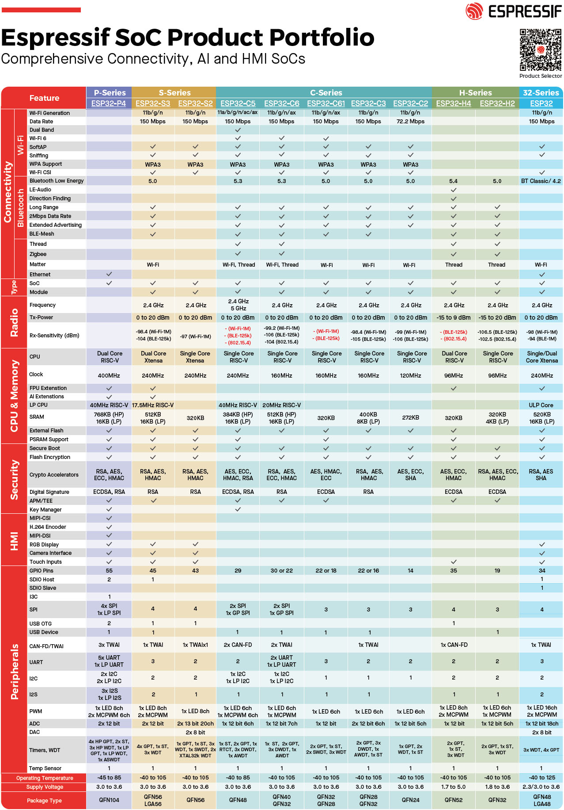

# ESP32Features

[-informational)](./CRA-EXEMPTION.md)
[](./LICENSE)
[](./README.md)

Welcome to ESP32Features, a guide and repository for the current ESP32 SoC family from Espressif Systems. This README provides an overview table of the relevant ESP32 models, based on the official Espressif datasheets and documentation (as of July 2026). The ESP32 series includes a wide range of microcontrollers optimized for IoT applications, edge computing, low-power sensors, and industrial systems—from legacy all-rounders like the classic ESP32 to modern RISC‑V‑based chips with Wi‑Fi 6, Bluetooth 5.4, and multi-protocol support (e.g., Zigbee/Thread for Matter-compatible smart homes).

## Why ESP32Features?

- **Complete coverage:** All models (ESP32, S2, S3, C3, C2, C5, C6, C61, H2, H4, P4, **E22, H21, S31**) with a focus on architecture, memory (SRAM, Flash, PSRAM), radios, interfaces, and low-power features.
- **Practical analysis:** Supplemented by deep sleep details, pros and cons, application evaluations, and combination suggestions for hybrid systems (e.g., P4 + C6 for Industry 4.0).
- **Up‑to‑date & source‑based:** Based on Espressif's Product Selector and datasheets (e.g., ESP32‑C5 in mass production since 2025, ESP32‑C6 with PSA Level 2 security certification, ESP32‑E22 Wi‑Fi 6E certified since June 2026).
- **For developers:** Integrated with ESP‑IDF, Arduino, and tools for rapid prototyping – ideal for smart devices, AI edge, and IIoT.

The table below summarizes the core features. For detailed analyses, see the subsections: [Espressif SoC Product Portfolio](#espressif-soc-product-portfolio), [Deep Sleep](#deep-sleep), [Advantages and Disadvantages](#thorough-evaluation-of-each-model), [Applications](#list-of-typical-applications), [Combinations](#useful-combinations-of-esp32-models), [Cryptographic Security & Post‑Quantum Readiness](#cryptographic-security--postquantum-readiness), and [References](#references--further-reading)

### Disclaimer 2026
The following models have been announced by Espressif since September 2025 and are **already included in the table below**:
- **ESP32‑E22** – Tri‑Band Wi‑Fi 6E + Dual‑Mode Bluetooth 5.4 Connectivity Co‑Processor (RCP) – available since Jan 2026, Wi‑Fi 6E‑certified since Jun 2026
- **ESP32‑H21** – Ultra‑Low‑Power BLE 5 + 802.15.4 SoC – available with preview support in ESP‑IDF v6.0 since March 2026
- **ESP32‑S31** – Dual‑Core RISC‑V SoC with Wi‑Fi 6, BT 5.4, 802.15.4, Gigabit Ethernet, and advanced HMI features – announced in March 2026, release pending

**Additional future models** (beyond those listed above) have **not** been announced by Espressif at this time. This list will be updated as new products are announced.

## Overview table of ESP32 models

| Model | Architecture (cores, Clock min/max, LP/ULP) | Embedded SRAM | Embedded Flash/PSRAM options (combos) | Max PSRAM (embedded/external, Future) | Max Flash (embedded/external, Future) | Radio (variants) | Interfaces (selection: number, type) |
|------------|--------------------------------------------|---------------|----------------------------------------|---------------------------------------|---------------------------------------|--------------------------------------------|-----------------------------------|
| ESP32 | Dual Xtensa LX6, 80‑240 MHz, no dedicated LP; ULP co‑proc (FSM‑based, for deep sleep) | 520 KB | Flash: 0/2/4 MB; PSRAM: 0/2 MB; Combos: e.g., U4WDH (2 MB Flash + 0 PSRAM), D0WDR2‑V3 (4 MB flash + 2 MB PSRAM) | 2 MB embedded / 8 MB external | 4 MB embedded / 16 MB external | Wi‑Fi 2.4 GHz (802.11 b/g/n), BT 4.2 (BR/EDR + LE) | 34 GPIOs; 4 SPI; 2 I2S; 2 I2C; 3 UART; Ethernet MAC; TWAI (CAN); ADC (18 ch., 12‑bit); Touch (10); DAC (2, 8‑bit) |
| ESP32‑S2 | Mono Xtensa LX7, 40‑240 MHz, no dedicated LP; ULP co‑procs (RISC‑V + FSM, not simultaneous) | 320 KB + 16 KB RTC | Flash: 0/2/4 MB; PSRAM: 0/2 MB; Combos: e.g. FH2 (2 MB flash + 0 PSRAM), FN4R2 (4 MB flash + 2 MB PSRAM), R2 (0 flash + 2 MB PSRAM) | 2 MB embedded / 1 GB external (typ. 64 MB) | 4 MB embedded / 1 GB external (typ. 128 MB) | Wi‑Fi 2.4 GHz (802.11 b/g/n) | 43 GPIOs; 4 SPI; 1 I2S; 2 I2C; 2 UART; USB OTG (FS); LCD (2: SPI/I2S); Camera (DVP 8/16‑bit); ADC (20 ch., 12‑bit); DAC (2, 8‑bit); Touch (14); RMT (4 ch.); LED PWM (8 ch.) |
| ESP32‑S3 | Dual Xtensa LX7, 40‑240 MHz, no dedicated LP; ULP co‑pros (RISC‑V + FSM, not simultaneous) | 512 KB + 16 KB RTC | Flash: 0/4/8/16 MB; PSRAM: 0/2/4/8/16 MB; Combos: e.g., FN8 (8 MB Flash + 0 PSRAM) , R2 (0 + 2 MB), R8 (0 + 8 MB), R16V (0 + 16 MB), FH4R2 (4 MB Flash + 2 MB PSRAM), FN4R8 (4 MB Flash + 8 MB PSRAM) | 16 MB embedded / 32 MB external (Future: 64 MB) | 16 MB embedded / 32 MB external (Future: 64 MB) | Wi‑Fi 2.4 GHz (802.11 b/g/n), BT 5 (LE) | 45 GPIOs; 4 SPI (2 mem., 2 gen.); 2 I2S; 2 I2C; 3 UART; USB OTG (FS); SD/MMC (2 slots); TWAI; LCD/Camera; ADC (20 ch., 12‑bit); Touch (14); MCPWM; RMT; PCNT; LED PWM |
| ESP32‑C3 | Mono RISC‑V, 40‑160 MHz, no dedicated LP/ULP | 400 KB (16 KB cache) | Flash: 0/4 MB; PSRAM: 0 MB; Combos: e.g. C3 (0 Flash + 0 PSRAM), FH4/C3FH4X (4 MB Flash + 0 PSRAM) – PSRAM external only | 0 MB embedded / 8 MB external (Future: 16 MB) | 4 MB embedded / 16 MB external | Wi‑Fi 2.4 GHz (802.11 b/g/n), BT 5 (LE) | 22/16 GPIOs; 3 SPI; 1 I2S; 1 I2C; 2 UART; USB Serial/JTAG; TWAI; LED PWM (6 ch.); RMT (4 ch.); ADC (6 ch., 12‑bit); Temp sensor |
| ESP32‑C2 | Mono RISC‑V, 20‑120 MHz, no dedicated LP/ULP | 272 KB (16 KB cache) | Flash: 0 MB (external only); PSRAM: 0 MB; Combos: None embedded (e.g., C2FH4: 0 + 0, but modules such as ESP8684 integrate 4 MB Flash external‑style) | 0 MB embedded / 8 MB external (Future: 16 MB) | 0 MB embedded / 16 MB external | Wi‑Fi 2.4 GHz (802.11 b/g/n), BT 5 (LE) | 14 GPIOs; 2 SPI; 1 I2S; 1 I2C; 2 UART; LED PWM; GDMA; SAR ADC (6 ch.); Temp sensor; USB Serial |
| ESP32‑C5 | Dual RISC‑V (HP/LP), HP 40‑240 MHz / LP 20‑48 MHz, dedicated LP yes; no separate ULP | 384 KB HP + 16 KB LP + 320 KB ROM | Flash: 0/4 MB; PSRAM: 0/8 MB; Combos: e.g. B. C5HF4 (4 MB Flash + 0 PSRAM), C5HR8 (0 Flash + 8 MB PSRAM) | 8 MB embedded / 32 MB external (future: 64 MB) | 4 MB embedded / 32 MB external (future: 64 MB) | Wi‑Fi dual‑band 6 (2.4/5 GHz, 802.11 a/b/g/n/ac/ax), BT LE 5 (Core 6.0), 802.15.4 (Zigbee 3.0 / Thread 1.4) | 29 GPIOs; 3 SPI; 1 I2S; 2 I2C (+1 LP); 3 UART (+1 LP); USB Serial/JTAG; 2 CAN FD; SDIO; LED PWM (6 ch.); MCPWM (6 ch.); RMT (4 ch.); PARLIO; PCNT (4); ADC (6 ch., 12‑bit); Temp sensor; Analog Comparator (2 pads) |
| ESP32‑C6 | Dual RISC‑V (HP/LP), HP 40‑160 MHz / LP 20 MHz, dedicated LP yes; no separate ULP | 512 KB HP + 16 KB LP | Flash: 0/4/8 MB; PSRAM: 0 MB; Combos: e.g. C6 (0 + 0), C6FH4 (4 MB flash + 0), C6FH8 (8 MB flash + 0) – PSRAM external only | 0 MB embedded / 16 MB external (Future: 32 MB) | 8 MB embedded / 16 MB external (Future: 32 MB) | Wi‑Fi 6 2.4 GHz (802.11 ax/b/g/n), BT 5.3 (LE + Mesh), 802.15.4 (Zigbee 3.0 / Thread 1.3) | 30/22 GPIOs; 3 SPI; 1 I2S; 2 I2C (+1 LP); 3 UART (+1 LP); USB Serial/JTAG; 2 TWAI; SDIO; LED PWM (6 ch.); MCPWM (3); RMT (4 ch.); PARLIO; PCNT (4); ADC (7 ch., 12‑bit); Temp sensor; GDMA; ETM |
| ESP32‑C61 | Mono RISC‑V, 40‑160 MHz, LP/ULP ja (Power Modes) | 320 KB | Flash: 0/4 MB; PSRAM: 0/2/8 MB; Kombos: z. B. C61HF4 (4 MB Flash + 0 PSRAM), C61HR2 (0 Flash + 2 MB PSRAM), C61HR8 (0 Flash + 8 MB PSRAM) – Quad SPI | 8 MB embedded / 32 MB external (Future) | 4 MB embedded / 32 MB external (Future) | Wi‑Fi 6 2.4 GHz (802.11 ax), BT 5 (LE) | 30 GPIOs; 2 SPI; 1 I2S; 1 I2C; 3 UART; USB Serial/JTAG; SDIO 2.0 Slave; LED PWM; RMT; TWAI; ADC (1 ch., 12‑bit); Temp sensor |
| ESP32‑H2 | Mono RISC‑V, 32 MHz (min typ. low‑power) / 96 MHz, no dedicated LP/ULP; LP components for deep sleep | 320 KB HP + 4 KB LP | Flash: 0/2/4 MB; PSRAM: 0 MB; Combos: e.g. H2FH2S (2 MB Flash + 0 PSRAM), H2FH4S (4 MB Flash + 0 PSRAM) – PSRAM external only | 0 MB embedded / 16 MB external (Future: 32 MB) | 4 MB embedded / 16 MB external (Future: 32 MB) | BT LE 5.3 (1/2 Mbps, Coded PHY, Long Range, Advertising Extensions), 802.15.4 (250 Kbps OQPSK, Thread/Zigbee 3.0/Matter) | 19 GPIOs; 2 SPI (Flash + gen.); 2 UART; 2 I2C; 1 I2S; RMT (2 tx/2 rx ch.); LED PWM (6 ch.); USB Serial/JTAG; TWAI (CAN); GDMA (3 tx/3 rx); PCNT; MCPWM; ADC (5 ch., 12‑bit); Temp sensor; Timers (2 gen. 54‑bit, 52‑bit sys., 3 WDT) |
| ESP32‑H4 | Dual RISC‑V, 96 MHz max, dedizierte LP ja (selective peripherals) | 320 KB | Flash: 0 MB; PSRAM: 0/4 MB; Kombos: z. B. H4 (0 Flash + 0 PSRAM), H4R4 (0 Flash + 4 MB PSRAM) – external Flash support | 0 MB embedded / 4 MB external (Future: 16 MB) | 0 MB embedded / 16 MB external (Future) | BT LE 5.4 (LE), 802.15.4 (Zigbee/Thread/Matter) | 35 GPIOs; I2C; I2S; SPI; UART; LED PWM; ADC; Timers; DMA; TWAI; USB OTG; MCPWM; Touch (14); Event Task Matrix |
| ESP32‑P4 | Dual HP + Mono LP RISC‑V, HP 40‑360 MHz / LP 40 MHz, dedicated LP yes; no separate ULP | 768 KB HP L2MEM + 32 KB LP + 8 KB SPM | Flash: 0 MB; PSRAM: 0/16/32 MB; Combos: e.g. P4NRW16 (0 Flash + 16 MB PSRAM), P4NRW32 (0 + 32 MB PSRAM) | 32 MB embedded / 64 MB external (Future: 128 MB) | 0 MB embedded / 64 MB external (Future: 128 MB) | No integrated radios (MCU‑focused, external possible) | 55 GPIOs (16 LP); 4 SPI (+1 LP); 3 I2S (+1 LP); 3 I2C (+1 Analog +1 I3C); 6 UART (5 HP +1 LP); USB HS/FS OTG + Serial/JTAG; Ethernet (10/100 RMII); 3 TWAI; SD/MMC; LED PWM (8 ch.) ; MCPWM (2); RMT (8 ch.); PARLIO; Touch (14); 2 ADC; VAD; Image: JPEG codec, ISP, H.264 encoder, MIPI CSI/DSI (2‑lane), LCD/Camera |
| **ESP32‑E22** | Dual RISC‑V HP Core @ **500 MHz**, RCP‑Architektur (Radio Co‑Processor) | **1 MB** | Keine embedded (RCP‑Design) | 0 MB embedded / extern über Host‑System | 0 MB embedded / extern über Host‑System | **Tri‑Band Wi‑Fi 6E** (2.4/5/6 GHz), 160 MHz Kanalbandbreite, 2×2 MU‑MIMO, Beamforming, 1024‑QAM, Datenrate bis 2,4 Gbps; **Bluetooth Classic (BR/EDR) + BLE 5.4**; Wi‑Fi CERTIFIED 6E™ (Jun 2026) | **30 GPIOs**; **PCIe 2.1**; **SDIO 3.0**; **USB 2.0**; Linux‑Treiber Open Source (Kernel 5.4+) |
| **ESP32‑H21** | Mono RISC‑V, bis **96 MHz** | 320 KB SRAM + 128 KB ROM | Keine embedded (extern über SPI‑Flash) | 0 MB embedded / extern (über SPI‑Flash) | 0 MB embedded / extern (über SPI‑Flash) | **BT LE 5.0** (BLE 5.3‑zertifiziert) + **802.15.4** (Thread/Zigbee/Matter); **20 dBm Sendeleistung**; **On‑Chip DC‑DC‑Wandler** | **19 GPIOs**; UART, SPI, I²C, I²S, PWM, ADC, Timers, DMA; USB Serial/JTAG |
| **ESP32‑S31** | Dual RISC‑V, **320 MHz**, **128‑Bit SIMD‑Datenpfad** | **512 KB SRAM** | S31 (0 + 0), externe Flash/PSRAM über Octal SPI | extern: bis 64 MB (250 MHz 8‑Bit DDR PSRAM) | extern: bis 64 MB (Octal SPI) | **Wi‑Fi 6** (2,4 GHz, 802.11ax); **BT 5.4** (LE + Classic BR/EDR); **IEEE 802.15.4** (Thread/Zigbee); **1000 Mbps Ethernet MAC** | **60 GPIOs**; DVP‑Camera (8‑16‑Bit); LCD (8‑24‑Bit parallel); 14× Touch; JPEG‑Codec; 2D‑Graphics‑Acceleration (PPA); 2D‑DMA; 2× I2S; USB OTG; SD/MMC; TWAI; SPI; I2C; UART; **Trusted Execution Environment (TEE)** mit APM; **RAM‑based PUF** |

### Notes on the table:

- **Architecture:** Takes into account cores (HP/LP), clock ranges, and low‑power features (ULP/LP).
- **Memory:** Embedded options with variant combos; max values incl. future support (e.g., up to 128 MB for P4).
- **Radios:** All variants, including multi‑protocol (e.g., Wi‑Fi 6 for C5/C6, 802.15.4 for C5/C6/H2 for Matter, Tri‑Band for E22).
- **Interfaces:** Important peripherals with quantities; focused on GPIOs, wireless relevance, and special features (e.g., MIPI for P4, PCIe for E22).
- **Sources:** Directly from Espressif datasheets; no new models beyond the list (as of 2025, e.g., C5 in mass production; C61/H4 new to the portfolio; E22/H21/S31 added in 2026).

### Espressif SoC Product Portfolio



> **Note:** The Espressif product portfolio image above (as of September 2025) **does not** include the **ESP32‑E22**, **ESP32‑H21**, and **ESP32‑S31** variants, which have been announced since then. These were added to the table at a later date.

## Deep sleep

The information is based on the Espressif SoC product portfolio and the official datasheets (as of July 2026). The structure takes into account the specific characteristics of the new models (e.g., C61 as a single‑core Wi‑Fi 6 low‑power, H4 as a dual‑core low‑power with 802.15.4, E22 as RCP with host‑controlled power management, H21 as ultra‑low‑power BLE/802.15.4 SoC). Since the exact deep sleep power consumption values for C61 and H4 are not explicitly stated in the portfolio, these are estimated based on similar models (C6/H2) and marked accordingly.

### Details

**All** ESP32 models (ESP32, S2, S3, C3, C2, C5, C6, C61, H2, H4, P4, **E22, H21, S31**) support deep sleep mode, and in most cases, special memory (RTC SRAM or comparable) can be used to back up data during deep sleep. However, there are differences in architecture (RTC SRAM, LP SRAM, or other mechanisms) that affect how and which memory is used for this purpose.

### Overview: Deep sleep and memory for backing up data

**Deep sleep mode:** All models can enter deep sleep, which shuts down the main processor (HP core) and most peripherals to save power. Certain memory areas remain active to back up data or perform simple tasks.

**RTC SRAM**: In models without a dedicated LP core (ESP32, S2, S3, some C3), the RTC SRAM is the main memory that remains active in deep sleep to back up data or execute ULP co‑processor code.

**LP SRAM**: In models with a dedicated LP core (C5, C6, H4, P4, **S31**), LP SRAM takes on this role, as the LP core can remain active in deep sleep mode. The H2/C61 has LP SRAM, but without an LP core, for data storage only.

**Special cases:** C2/C3 have small RTC areas (<8 KB) without ULP/LP core, limited. H2/C61 are optimized for ultra‑low consumption (approx. 7–10 μA), with LP peripherals. H4 has a dedicated LP core for more flexible low‑power tasks. **E22** as RCP is typically controlled by a host; low‑power management is handled by the host. **H21** offers 5 µA deep sleep with on‑chip DC‑DC converter. **S31** deep sleep specifications are not yet fully published.

### Model‑specific details

#### ESP32:

- **Deep sleep:** Yes, supported.
- **Memory:** 520 KB SRAM, part of which (not separately specified as “RTC SRAM,” but approx. 8 KB in the RTC domain) remains active in deep sleep. The ULP co‑processor (FSM‑based) can access it to save data or perform simple tasks.
- **Usage:** Saving variables in the RTC memory area (via RTC memory API), e.g., status data, counters, or sensor values. The ULP can process this data.
- **Limit:** Limited memory compared to newer models; ULP is not as flexible as an LP core.

#### ESP32‑S2:

- **Deep sleep:** Yes, supported.
- **Memory:** 16 KB RTC SRAM explicitly in the datasheet, remains active in deep sleep. Two ULP co‑pros (RISC‑V + FSM, not simultaneous) can access it.
- **Usage:** RTC SRAM can be used for data (e.g., states, configuration data). The RISC‑V ULP allows for more complex calculations than the classic ESP32.
- **Limit:** 16 KB is not huge, but sufficient for most sensor or status data.

#### ESP32‑S3:

- **Deep sleep:** Yes, supported.
- **Memory:** 16 KB RTC SRAM, remains active in deep sleep. ULP co‑pros (RISC‑V + FSM) can use this memory.
- **Usage:** Similar to S2, ideal for data such as configurations, sensor values, or small state machines. The ULP RISC‑V is programmable for more complex deep sleep logic.
- **Limit:** Like S2, 16 KB RTC SRAM limits the amount of data.

#### ESP32‑C3:

- **Deep sleep:** Yes, supported.
- **Memory:** No explicit RTC SRAM, but part of the 400 KB SRAM (approx. 8 KB in the RTC domain, similar to ESP32) remains active in deep sleep. No ULP co‑processor, therefore no programming in deep sleep.
- **Usage:** You can save data in the RTC area (via ESP‑IDF RTC memory APIs), but without ULP only static storage, no active processing.
- **Limit:** No ULP or LP core limits flexibility; smaller memory area.

#### ESP32‑C2:

- **Deep sleep:** Yes, supported.
- **Memory:** No explicit RTC SRAM or LP SRAM. A small RTC area (not quantified in the datasheet, estimated <8 KB) remains active, similar to C3.
- **Usage:** Limited data storage possible in the RTC area (e.g., state variables), but no active processing as there is no ULP or LP core.
- **Limit:** Very limited, as there is no dedicated memory or co‑processor.

#### ESP32‑C5:

- **Deep sleep:** Yes, supported (HP core off, LP core can remain active).
- **Memory:** 16 KB LP SRAM for the dedicated LP core (RISC‑V), remains active in deep sleep. No separate RTC SRAM, as the LP core takes over these tasks.
- **Usage:** LP SRAM can be used for data and code of the LP core running in deep sleep. Ideal for complex low‑power logic or data storage.
- **Limit:** 16 KB LP SRAM is sufficient but not huge; LP core offers more flexibility than ULP.

#### ESP32‑C6:

- **Deep sleep:** Yes, supported (similar to C5).
- **Memory:** 16 KB LP SRAM for the LP core, remains active in deep sleep. No separate RTC SRAM.
- **Usage:** Like C5, LP SRAM for LP core data/code, suitable for complex deep sleep tasks.
- **Limit:** 16 KB LP SRAM, but more flexible due to LP core.

#### ESP32‑C61:

- **Deep sleep:** Yes, supported (optimized for low‑power Wi‑Fi 6, est. ~10 μA).
- **Memory:** 4 KB LP SRAM, remains active in deep sleep. No separate RTC SRAM or dedicated LP core.
- **Usage:** LP SRAM for passive data storage (e.g., state variables, sensor data) in deep sleep; LP peripherals (e.g., timers, ADC) support simple tasks.
- **Limit:** 4 KB LP SRAM is small; no LP core, therefore no complex processing in deep sleep.

#### ESP32‑H2:

- **Deep sleep:** Yes, supported (optimized for ultra‑low consumption, 7 μA).
- **Memory:** 4 KB LP SRAM, remains active in deep sleep. No separate RTC SRAM or dedicated LP core.
- **Usage:** LP SRAM for passive data storage (e.g., state variables, sensor data) in deep sleep; LP peripherals (e.g., timers, sensors) support simple tasks.
- **Limit:** 4 KB LP SRAM is small; no LP core, therefore no complex processing in deep sleep.

#### ESP32‑H4:

- **Deep sleep:** Yes, supported (optimized for ultra‑low consumption with selective peripherals, est. ~7 μA).
- **Memory:** 16 KB LP SRAM for the LP core, remains active in deep sleep. No separate RTC SRAM.
- **Usage:** LP SRAM for LP core data/code, suitable for complex deep sleep tasks (e.g., Mesh‑Networking, sensor processing).
- **Limit:** 16 KB LP SRAM, but flexible due to dedicated LP core.

#### ESP32‑P4:

- **Deep sleep:** Yes, supported (HP cores off, LP core active).
- **Memory:** 32 KB LP SRAM for the LP core, remains active in deep sleep. No RTC SRAM, as LP core takes over low‑power tasks.
- **Usage:** LP SRAM for LP core data and code, ideal for demanding low‑power applications (e.g., image processing, sensor logic).
- **Limit:** 32 KB is more generous than C5/C6, no significant limitations.

#### ESP32‑E22:

- **Deep sleep:** Yes (as RCP in host‑based system).
- **Memory:** No dedicated LP SRAM (RCP design).
- **Usage:** As Radio Co‑Processor (RCP), ESP32‑E22 is typically controlled by a host SoC. Low‑power management is handled by the host processor. The ESP32‑E22 itself can be placed into a power‑saving state while the host manages deep sleep. Exact deep sleep current values are not yet specified in the datasheet.
- **Limit:** RCP architecture – no standalone low‑power operation without host.

#### ESP32‑H21:

- **Deep sleep:** Yes – **5 µA** in deep sleep.
- **Memory:** 4 KB LP SRAM (like H2).
- **Usage:** LP SRAM for passive data storage in deep sleep; LP peripherals support simple tasks. On‑chip DC‑DC converter improves efficiency during RX operation (approx. 8.2 mA active RX).
- **Limit:** 4 KB – no complex processing in deep sleep (no dedicated LP core).

#### ESP32‑S31:

- **Deep sleep:** Yes (specifications not yet fully published).
- **Memory:** Expected to have RTC/LP SRAM (similar to S3).
- **Usage:** As successor to the S‑series (S2/S3), ESP32‑S31 is expected to feature ULP co‑processors (RISC‑V + FSM) and RTC SRAM for deep‑sleep operations. Exact power consumption values are not yet available.
- **Limit:** Specifications not yet fully published.

### Summary

- **All** ESP32 models support deep sleep.
- **RTC memory** (or equivalent) for data backup on all models
- **ESP32, S2, S3:** RTC SRAM (16 KB on S2/S3, smaller range on classic ESP32) for data storage, supported by ULP co‑pros.
- **C3, C2:** Small RTC area (not explicitly specified, <8 KB), only for static data storage, no ULP/LP core.
- **C5, C6, H2, P4:** LP SRAM (16 KB for C5/C6, 32 KB for P4) for data storage and LP core tasks, more flexible than RTC SRAM.
- **E22:** RCP architecture – low‑power controlled by host.
- **H21:** 5 µA deep sleep, 4 KB LP SRAM, no LP core.
- **S31:** Expected to have RTC SRAM and ULP co‑pros (specifications pending).
- **Differences:** Models with ULP (ESP32, S2, S3) or LP core (C5, C6, H2, P4, **S31**) offer more flexibility as they can actively execute code in deep sleep. C3 and C2 are limited (storage only, no processing).
- **C5, C6, H2, P4** can also use the LP core to be active **in deep sleep**.

## Thorough evaluation of each model

Based on the official Espressif datasheets (as of July 2026) and the details collected from the sources, each ESP32 model is analyzed in terms of its advantages and disadvantages. The focus is on **key usability**, i.e., how the features (architecture, memory, radios, interfaces, power) optimize the model for specific areas of application. The evaluation takes into account factors such as performance, energy efficiency, cost, compatibility (e.g., RISC‑V vs. Xtensa), wireless options, and peripherals. Models with RISC‑V are future‑oriented (better for open source), while Xtensa is established. Newer models (C series, H2, P4, **E22, H21, S31**) emphasize low power and multi‑protocol (e.g., Matter), while older models (Classic, S2, S3) are more general but consume more power.

#### ESP32
- **Focus**: All‑rounder for wireless networks and legacy applications; strong in Wi‑Fi + BT Classic/LE combinations with Ethernet/CAN.
- **Advantages**: Dual‑core Xtensa for parallel tasks (e.g., Wi‑Fi + BT), established ecosystem (lots of code available), Ethernet MAC and TWAI (CAN) for industrial networks, inexpensive and robust, ULP co‑proc for simple low‑power tasks.
- **Disadvantages**: Higher power consumption (deep sleep ~10 μA, active >100 mA), Xtensa architecture less forward‑looking (fewer open‑source tools), no Wi‑Fi 6/BT 5, limited memory options (max 4 MB embedded flash), outdated (NRND for some variants), no dedicated LP core.
- **Overall rating**: Good for cost‑effective, established projects with mixed connectivity, but not ideal for ultra‑low‑power or modern protocols.

#### ESP32‑S2
- **Focus**: USB and multimedia‑focused (LCD/camera/touch), for Wi‑Fi‑only devices with low power.
- **Advantages**: USB OTG (FS) for HID/storage, LCD/camera interfaces for displays, 14 touch sensors, ULP co‑pros (RISC‑V + FSM) for flexible deep sleep, large external memory support (up to 1 GB), compact and energy‑efficient for Wi‑Fi apps.
- **Disadvantages**: No BT, mono‑core Xtensa (less performance), no Ethernet/CAN, touch not CS‑certified (restrictions in noisy environments), higher consumption than C series (deep sleep ~5‑7 μA), outdated compared to S3.
- **Overall rating**: Strong for USB‑based or display/touch devices (e.g., smart panels), but limited without BT/multi‑core.

#### ESP32‑S3
- **Focus**: AI and multimedia (vector/AI extensions, LCD/camera), for edge computing with Wi‑Fi/BT LE.
- **Advantages**: Dual‑core Xtensa with AI/DSP extensions (e.g., 128‑bit vector), USB OTG/SD for storage, LCD/camera for video, ULP co‑pros for low power, large memory (up to 16 MB embedded PSRAM), BT 5 LE for modern apps.
- **Disadvantages**: No Wi‑Fi 6, higher power consumption (deep sleep ~7 μA, active >100 mA), Xtensa instead of RISC‑V, ADC/Wi‑Fi conflicts, more expensive than C series, no 802.15.4.
- **Overall rating**: Ideal for AI/multimedia (e.g., voice/image recognition), but not optimal for ultra‑low‑power or multi‑protocol IoT.

#### ESP32‑C3
- **Focus**: Low‑cost, low‑power wireless (Wi‑Fi + BT LE) for simple sensors.
- **Advantages**: RISC‑V mono‑core (forward‑looking), Wi‑Fi + BT 5 LE, TWAI (CAN), USB serial/JTAG, inexpensive and compact, external memory up to 16 MB.
- **Disadvantages**: No ULP/LP core (limited deep sleep processing, ~5 μA), limited GPIOs (22/16), no Ethernet/USB OTG, mono‑core limits performance, some variants EOL/NRND.
- **Overall rating**: Perfect for low‑cost, battery‑powered sensors, but weak in multimedia/high performance.

#### ESP32‑C2
- **Focus**: Ultra‑low‑cost minimalist for low‑power wireless.
- **Advantages**: Very inexpensive and small, RISC‑V mono‑core, Wi‑Fi + BT 5 LE, low power (deep sleep <8 μA), external memory support.
- **Disadvantages**: No embedded flash/PSRAM (external only), few GPIOs (14), minimal interfaces (no USB OTG/Ethernet/CAN), no ULP/LP core, limited SRAM (272 KB).
- **Overall rating**: For mass‑produced, simple wireless devices (e.g., tags), but too limited for complex apps.

#### ESP32‑C5
- **Focus**: Modern multi‑protocol wireless (dual‑band Wi‑Fi 6 + BT LE 5 + 802.15.4), for low‑power IoT with LP core.
- **Advantages**: Dual‑band Wi‑Fi 6 (2.4/5 GHz), BT LE 5 (incl. direction finding), 802.15.4 (Zigbee/Thread), dedicated LP core (RISC‑V, up to 48 MHz), CAN FD, low power (deep sleep ~12 μA), RISC‑V dual core.
- **Disadvantages**: Fewer GPIOs (29), limited embedded memory (4 MB flash/8 MB PSRAM), higher price, new (less established).
- **Overall rating**: Strong for smart home/IoT networks (Matter‑compatible), but not for high performance without wireless.

#### ESP32‑C6
- **Focus**: Low‑power multi‑protocol (Wi‑Fi 6 2.4GHz + BT 5.3 + 802.15.4), for battery‑powered IoT with LP core.
- **Advantages**: Wi‑Fi 6 (2.4 GHz), BT 5.3 (mesh), 802.15.4 (Zigbee/Thread), dedicated LP core (RISC‑V, 20 MHz), low power (deep sleep 7 μA), RISC‑V dual‑core, TWAI.
- **Disadvantages**: No 5 GHz Wi‑Fi, limited embedded PSRAM (external only), 30/22 GPIOs, no USB OTG/Ethernet.
- **Overall rating**: Ideal for energy‑efficient smart devices (e.g., sensor networks), better than C5 in terms of power, but without dual band.

#### ESP32‑H2
- **Focus**: Ultra‑low‑power non‑Wi‑Fi wireless (BT LE 5.3 + 802.15.4), for Thread/Zigbee/Matter.
- **Advantages**: BT LE 5.3 (long range, mesh), 802.15.4 (Zigbee/Thread), RISC‑V mono‑core (96 MHz), ultra‑low power (deep sleep 7 μA), USB Serial/JTAG, compact.
- **Disadvantages**: No Wi‑Fi, small SRAM (320 KB + 4 KB LP), few GPIOs (19), no dedicated LP core (only LP components), limited interfaces.
- **Overall rating**: Ideal for battery‑powered mesh networks (e.g., smart lighting), but unsuitable for Wi‑Fi apps.

#### ESP32‑P4
- **Focus**: High‑performance MCU without radios, for AI/multimedia (JPEG/H.264/MIPI) with wired connectivity.
- **Advantages**: Dual‑HP + mono‑LP RISC‑V (up to 360 MHz), AI/DSP extensions, multimedia (JPEG codec, H.264 encoder, MIPI CSI/DSI), USB HS/FS OTG, Ethernet, 55 GPIOs (16 LP), large memory (up to 32 MB embedded PSRAM), VAD/Touch.
- **Disadvantages**: No integrated radios (external required), no embedded flash, higher power consumption (deep sleep 0.025 mA), more expensive, new (less support).
- **Overall rating**: Perfect for high‑performance wired/AI devices (e.g., HMI panels), but not for wireless without add‑ons.

#### ESP32‑E22
- **Focus**: High‑Performance Wireless Connectivity Co‑Processor (RCP) for Tri‑Band Wi‑Fi 6E + Dual‑Mode Bluetooth.
- **Advantages**:
  - **First tri‑band Wi‑Fi 6E SoC from Espressif** (2.4 / 5 / 6 GHz)
  - **160 MHz channel bandwidth + 2×2 MU‑MIMO + Beamforming** for high throughput and low latency
  - **Dual‑Core RISC‑V at 500 MHz**
  - **Data rate up to 2.4 Gbps**
  - **Bluetooth Classic (BR/EDR) + BLE 5.4** in one chip
  - **RCP architecture** – offloads networking stacks from host
  - **Flexible host interfaces**: PCIe 2.1, SDIO 3.0, USB 2.0
  - **Open‑source Linux driver** (Kernel 5.4+) – lowers integration barrier
  - **Wi‑Fi CERTIFIED 6E™** – guarantees interoperability
- **Disadvantages**:
  - **No standalone MCU operation** – always relies on host processor (RCP design)
  - **No embedded Flash/PSRAM** – memory via host
  - **No dedicated LP core** – low‑power controlled by host
  - **Higher price** – high‑end positioning
  - **New** – ecosystem less established (but Linux driver is open source)
- **Overall rating**: Ideal for **high‑bandwidth applications** like 4K/8K video streaming, AR/VR accessories, industrial bridging solutions, and next‑gen smart‑home hubs. Not suitable for standalone, battery‑powered low‑power sensors.

#### ESP32‑H21
- **Focus**: Ultra‑Low‑Power Wireless SoC for Thread, Matter, Zigbee and BLE‑based, battery‑powered IoT devices.
- **Advantages**:
  - **Extremely low power consumption**: Deep sleep 5 µA, Light sleep 9 µA
  - **On‑chip DC‑DC converter** – reduces active current (RX: 8.2 mA)
  - **20 dBm transmit power** – improved range and link robustness
  - **ESP‑Matter‑SDK compatible** – seamless Matter‑over‑Thread development
  - **ESP‑BLE‑MESH support** – scalable multi‑node networks
  - **ESP‑IDF fully supported** – incl. ESP‑IDF v6.0
  - **RISC‑V architecture** – future‑oriented
- **Disadvantages**:
  - **No Wi‑Fi** – only BT LE + 802.15.4
  - **No dedicated LP core** – only LP components (like H2)
  - **Limited SRAM** (320 KB) – less than H4 (384 KB)
  - **No USB OTG** – only USB Serial/JTAG
  - **Incremental update to H2** – no radical changes
- **Overall rating**: Ideal for **ultra‑low‑power, battery‑operated mesh networks** (smart‑home sensors, building automation, wearables). Better energy efficiency than H2 due to DC‑DC converter. Not suitable for Wi‑Fi applications.

#### ESP32‑S31
- **Focus**: High‑Performance Dual‑Core RISC‑V SoC with Wi‑Fi 6, BT 5.4, 802.15.4, Gigabit‑Ethernet and advanced HMI capabilities.
- **Advantages**:
  - **First RISC‑V SoC of the S‑series** – replacing Xtensa (S2/S3)
  - **Wi‑Fi 6 + BT 5.4 (LE + Classic) + 802.15.4 + Gigabit‑Ethernet** – All‑in‑One connectivity
  - **128‑bit SIMD data path** – accelerates AI/ML workloads
  - **Comprehensive HMI functions**: DVP camera, LCD (8‑24‑bit), 14× Touch, JPEG codec, 2D‑Graphics
  - **60 GPIOs** – very flexible
  - **RAM‑based PUF + TEE + APM** – highest security level
  - **Matter‑compatible** (Wi‑Fi + Thread)
- **Disadvantages**:
  - **Announced, but not yet fully available**
  - **No exact power consumption values** known yet
  - **Complexity** – many features increase development effort
  - **Positioning** – between S3 (AI/multimedia) and P4 (high‑performance) → possible overlaps
- **Overall rating**: ESP32‑S31 is the **successor to S2/S3 with RISC‑V architecture** and an expanded feature set. It combines **Wi‑Fi 6, BT 5.4, 802.15.4 and Gigabit‑Ethernet** with **advanced HMI and security features**. Ideal for **demanding IoT applications** with high requirements for connectivity, multimedia and security.

## List of typical applications

Below is a list of **50** typical applications for ESP32 models, based on Espressif recommendations (e.g., smart home, IoT, industrial). These cover areas such as low‑power sensors, multimedia, AI, industrial, and wearables. The list is numbered and briefly describes the focus.

1. Smart home hub (e.g., central control with multi‑protocol).
2. Wi‑Fi access point/extender (e.g., network extension).
3. Bluetooth audio device (e.g., speaker/headset).
4. Low‑power sensor node (e.g., environmental sensor with battery).
5. AI edge computing (e.g., voice recognition).
6. Security Camera (e.g., video surveillance with streaming).
7. Wearable Fitness Tracker (e.g., pedometer with BT).
8. Industrial IoT Gateway (e.g., data collection with CAN/Ethernet).
9. Zigbee/Thread Smart Lighting (e.g., lamp control).
10. USB HID Device (e.g., mouse/keyboard).
11. Ethernet‑Connected Controller (e.g., wired automation).
12. CAN‑Bus Vehicle Monitor (e.g., auto diagnostics).
13. LCD display panel (e.g., HMI interface).
14. Touch screen device (e.g., control panel).
15. Battery‑powered remote control (e.g., IR/remote control).
16. Matter‑compatible smart plug (e.g., power outlet with multi‑protocol).
17. Wi‑Fi 6 mesh network (e.g., home mesh).
18. Bluetooth mesh sensor network (e.g., building monitoring).
19. 802.15.4 low‑power mesh (e.g., Thread network).
20. Robotics controller (e.g., motor control with PWM).
21. Barcode scanner (e.g., image processing).
22. Voice Assistant (e.g., voice control).
23. Secure IoT Device (e.g., with encryption/boot).
24. Environmental Monitoring Station (e.g., weather station).
25. SD card data logger (e.g., logging with storage).
26. PWM motor driver (e.g., DC motors).
27. Analog sensor reader (e.g., temp/pressure with ADC).
28. Asset tracking tag (e.g., BT LE beacon).
29. Smart Thermostat (e.g., heating control).
30. POS Terminal (e.g., payment terminal with display).
31. Service Robot Brain (e.g., navigation with AI).
32. Audio Streaming Device (e.g., music player).
33. Health monitoring wearable (e.g., pulse sensor).
34. Agricultural sensor (e.g., soil moisture with low power).
35. Vending machine controller (e.g., payment/display).
36. **4K/8K video streaming device** (E22: high bandwidth).
37. **AR/VR accessory** (E22: low latency).
38. **Wireless network adapter (M.2 format)** (E22: PCIe/SDIO).
39. **Industrial bridging solution** (E22: robust Wi‑Fi 6E).
40. **Set‑top box / laptop connectivity** (E22: PCIe/SDIO integration).
41. **Matter‑over‑Thread sensor** (H21: ESP‑Matter‑SDK, 5 µA deep sleep).
42. **Bluetooth‑Mesh lighting** (H21: ESP‑BLE‑MESH, 20 dBm).
43. **Occupancy / environmental sensor** (H21: ultra‑low‑power, 5 µA).
44. **Asset tracking tag** (H21: 5 µA deep sleep, 20 dBm range).
45. **Wearable health monitor** (H21: ultra‑low‑power, compact GPIOs).
46. **Smart speaker / Voice assistant** (S31: BT 5.4 LE Audio + I2S + AI acceleration).
47. **Industrial HMI panel** (S31: LCD 24‑bit, Touch 14×, Ethernet).
48. **Security camera with Edge‑AI** (S31: DVP camera + JPEG codec + AI acceleration).
49. **Matter gateway (Wi‑Fi + Thread)** (S31: Wi‑Fi 6 + 802.15.4 + Ethernet).
50. **POS terminal** (S31: USB OTG + SD/MMC + security features).

### Evaluation table

The table evaluates the suitability of each model for the applications with ++ (very good, optimal), + (good, feasible), 0 (neutral, with limitations), - (poor, unsuitable), -- (very poor, impossible). Evaluation is based on features (e.g., radios for wireless, LP core for low power, interfaces for multimedia). Optional text in parentheses explains key reasons.

| Application | ESP32 | ESP32‑S2 | ESP32‑S3 | ESP32‑C3 | ESP32‑C2 | ESP32‑C5 | ESP32‑C6 | ESP32‑H2 | ESP32‑P4 | **ESP32‑E22** | **ESP32‑H21** | **ESP32‑S31** |
|-----------|-------|----------|----------|----------|----------|----------|----------|----------|----------|----------|----------|----------|
| 1. Smart home hub | ++ (Wi‑Fi/BT + Ethernet) | + (Wi‑Fi, but no BT) | ++ (AI/multimedia + BT LE) | + (low‑cost Wi‑Fi/BT) | 0 (minimal, but Wi‑Fi/BT) | ++ (Multi‑Protocol Wi‑Fi 6) | ++ (Wi‑Fi 6 + 802.15.4) | + (802.15.4/BT, no Wi‑Fi) | + (High‑Perf, but external radios) | ++ (Tri‑Band Wi‑Fi 6E + BT Classic/BLE) | + (802.15.4/BT, no Wi‑Fi) | ++ (Wi‑Fi 6 + 802.15.4 + Ethernet) |
| 2. Wi‑Fi Access Point/Extender | ++ (Dual‑Core Wi‑Fi) | ++ (Wi‑Fi + USB) | ++ (Wi‑Fi + Memory) | + (Low‑Power Wi‑Fi) | + (Minimal Wi‑Fi) | ++ (Dual‑Band Wi‑Fi 6) | ++ (Wi‑Fi 6) | -- (No Wi‑Fi) | - (No Radios) | ++ (Tri‑Band Wi‑Fi 6E) | -- (No Wi‑Fi) | ++ (Wi‑Fi 6) |
| 3. Bluetooth Audio Device | ++ (BT Classic/LE) | -- (No BT) | ++ (BT LE + I2S) | + (BT LE) | + (BT LE) | ++ (BT LE 5 + I2S) | ++ (BT 5.3 Mesh) | ++ (BT LE 5.3) | + (I2S/LP, but external BT) | ++ (BT Classic + BLE 5.4) | ++ (BT LE 5.3 + I2S) | ++ (BT 5.4 LE Audio + Classic) |
| 4. Low‑Power Sensor Node | + (ULP, but power‑intensive) | + (ULP co‑pros) | + (ULP co‑pros) | ++ (Low‑Power RISC‑V) | ++ (Ultra‑Low‑Cost/Power) | ++ (LP core + low power consumption) | ++ (LP core + 7μA deep sleep) | ++ (ultra‑low power 7μA) | + (LP core, but no wireless) | - (No standalone low‑power) | ++ (5 µA deep sleep) | + (LP core expected, specs pending) |
| 5. AI edge computing | + (dual core) | 0 (single core) | ++ (vector/AI extensions) | - (Single‑Core, Low SRAM) | -- (Minimal) | + (Dual‑Core RISC‑V) | + (Dual‑Core) | - (Single‑Core, Low SRAM) | ++ (AI/DSP Extensions) | 0 (RCP, no AI) | - (Single‑Core, no AI) | ++ (128‑bit SIMD + AI/DSP) |
| 6. Security Camera | + (Wi‑Fi/BT) | ++ (LCD/Camera + Wi‑Fi) | ++ (LCD/Camera + AI) | 0 (No camera interface) | - (Minimal interfaces) | + (Wi‑Fi 6, but no camera) | + (Wi‑Fi 6) | - (No Wi‑Fi/camera) | ++ (MIPI CSI/DSI + H.264) | 0 (No camera) | - (No Wi‑Fi/camera) | ++ (DVP + JPEG + AI) |
| 7. Wearable fitness tracker | + (BT + touch) | + (touch + low power) | ++ (BT LE + touch/AI) | ++ (BT LE + low power) | ++ (low power BT LE) | ++ (BT LE 5 + LP core) | ++ (BT 5.3 + LP core) | ++ (BT LE 5.3 low power) | + (Touch + LP, but large) | 0 (No BT LE) | ++ (BT LE 5.3 low power) | ++ (BT 5.4 + Touch) |
| 8. Industrial IoT Gateway | ++ (Ethernet/CAN + Dual‑Core) | + (USB/TWAI) | ++ (TWAI + SD) | + (TWAI + Low‑Cost) | 0 (Minimal) | ++ (CAN FD + Multi‑Protocol) | ++ (TWAI + Wi‑Fi 6) | + (802.15.4 + TWAI) | ++ (Ethernet + CAN) | + (RCP, no CAN) | + (TWAI) | ++ (Gigabit Ethernet + TWAI) |
| 9. Zigbee/Thread Smart Lighting | 0 (No 802.15.4) | 0 (No 802.15.4) | 0 (No 802.15.4) | 0 (No 802.15.4) | 0 (No 802.15.4) | ++ (802.15.4 + Zigbee/Thread) | ++ (802.15.4 + Thread 1.3) | ++ (802.15.4 + Zigbee/Thread) | - (No radios) | 0 (No 802.15.4) | ++ (802.15.4 + Thread/Zigbee/Matter) | ++ (802.15.4 + Thread/Zigbee) |
| 10. USB HID Device | + (UART/USB Serial) | ++ (USB OTG FS) | ++ (USB OTG FS) | + (USB Serial) | + (USB Serial) | + (USB Serial) | + (USB Serial) | + (USB Serial) | ++ (USB HS/FS OTG) | + (USB 2.0) | + (USB Serial) | ++ (USB OTG) |
| 11. Ethernet‑Connected Controller | ++ (Ethernet MAC) | - (No Ethernet) | - (No Ethernet) | - (No Ethernet) | - (No Ethernet) | - (No Ethernet) | - (No Ethernet) | - (No Ethernet) | ++ (Ethernet 10/100) | 0 (No Ethernet‑MAC – via host) | - (No Ethernet) | ++ (Gigabit Ethernet MAC) |
| 12. CAN bus vehicle monitor | ++ (TWAI/CAN) | + (TWAI) | + (TWAI) | ++ (TWAI) | - (No CAN) | ++ (2x CAN FD) | ++ (2x TWAI) | + (TWAI) | ++ (3x TWAI) | 0 (No CAN) | + (TWAI) | ++ (TWAI) |
| 13. LCD Display Panel | + (I2S/SPI) | ++ (LCD Interface) | ++ (LCD/Camera) | 0 (No LCD) | - (Minimal) | 0 (No LCD) | 0 (No LCD) | 0 (No LCD) | ++ (MIPI DSI + LCD) | 0 (No LCD) | 0 (No LCD) | ++ (24‑bit parallel LCD + 2D‑Graphics) |
| 14. Touch Screen Device | ++ (10 Touch) | ++ (14 Touch) | ++ (14 Touch) | - (No Touch) | - (No Touch) | - (No Touch) | - (No Touch) | - (No Touch) | ++ (14 Touch) | - (No Touch) | - (No Touch) | ++ (14× Touch) |
| 15. Battery‑Powered Remote | + (BT + Low‑Power) | + (Wi‑Fi + RMT) | + (BT LE) | ++ (BT LE Low‑Power) | ++ (BT LE Minimal) | ++ (BT LE 5 LP‑Core) | ++ (BT 5.3 LP‑Core) | ++ (BT LE 5.3 Low‑Power) | + (RMT + LP‑Core) | 0 (No BT LE) | ++ (BT LE 5.3 + 5µA) | ++ (BT 5.4 + LP core) |
| 16. Matter‑Compatible Smart Plug | + (Wi‑Fi/BT) | + (Wi‑Fi) | + (Wi‑Fi/BT LE) | + (Wi‑Fi/BT LE) | + (Wi‑Fi/BT LE) | ++ (Multi‑Protocol) | ++ (Wi‑Fi 6 + 802.15.4) | ++ (802.15.4/BT LE) | - (No radios) | + (Wi‑Fi/BT, no 802.15.4) | ++ (802.15.4/BT LE + Matter) | ++ (Wi‑Fi 6 + 802.15.4) |
| 17. Wi‑Fi 6 Mesh Network | - (No Wi‑Fi 6) | - (No Wi‑Fi 6) | - (No Wi‑Fi 6) | - (No Wi‑Fi 6) | - (No Wi‑Fi 6) | ++ (Dual‑band Wi‑Fi 6) | ++ (Wi‑Fi 6 2.4GHz) | -- (No Wi‑Fi) | - (No radios) | ++ (Tri‑Band Wi‑Fi 6E) | -- (No Wi‑Fi) | ++ (Wi‑Fi 6) |
| 18. Bluetooth Mesh Network | + (BT LE) | -- (No BT) | ++ (BT 5 LE Mesh) | + (BT 5 LE) | + (BT 5 LE) | ++ (BT LE 5) | ++ (BT 5.3 Mesh) | ++ (BT LE 5.3 Mesh) | - (No radios) | ++ (BT Classic + BLE 5.4) | ++ (BT LE 5.3 Mesh) | ++ (BT 5.4 Mesh 1.1) |
| 19. 802.15.4 Low‑Power Mesh | - (No 802.15.4) | - (No 802.15.4) | - (No 802.15.4) | - (No 802.15.4) | - (No 802.15.4) | ++ (802.15.4) | ++ (802.15.4) | ++ (802.15.4) | - (No radios) | 0 (No 802.15.4) | ++ (802.15.4) | ++ (802.15.4) |
| 20. Robotics Controller | ++ (Dual‑core + PWM) | + (Single‑core + PWM) | ++ (Dual‑Core + MCPWM) | + (Mono‑Core + PWM) | 0 (Minimal PWM) | ++ (MCPWM + Dual‑Core) | ++ (MCPWM + Dual‑Core) | + (MCPWM) | ++ (MCPWM + High‑Perf) | 0 (RCP, no PWM) | + (PWM) | ++ (MCPWM) |
| 21. Barcode Scanner | + (Wi‑Fi/BT) | ++ (Camera) | ++ (Camera + AI) | 0 (No Camera) | - (No Camera) | 0 (No Camera) | 0 (No Camera) | 0 (No Camera) | ++ (ISP + MIPI CSI) | 0 (No Camera) | 0 (No Camera) | ++ (DVP + JPEG) |
| 22. Voice Assistant | + (Dual‑Core + I2S) | + (I2S + USB) | ++ (I2S + AI) | 0 (I2S, but Mono) | 0 (I2S Minimal) | + (I2S + Dual‑Core) | + (I2S + Dual‑Core) | + (I2S) | ++ (VAD + I2S/LP) | 0 (No I2S/AI) | + (I2S) | ++ (BT 5.4 LE Audio + I2S + AI) |
| 23. Secure IoT Device | ++ (Crypto Accel) | ++ (Crypto + Secure Boot) | ++ (Crypto + Secure Boot) | ++ (Crypto) | + (Crypto) | ++ (Crypto + XTS‑AES) | ++ (Crypto + XTS‑AES) | ++ (Crypto) | ++ (Crypto + DSA) | ++ (Full WPA3 security in RCP) | ++ (Crypto) | ++ (PUF + TEE + APM) |
| 24. Environmental Monitoring Station | + (ADC + Wireless) | + (ADC + Touch) | + (ADC + Touch) | ++ (ADC + Low‑Power) | ++ (ADC + Low‑Power) | ++ (ADC + LP‑Core) | ++ (ADC + LP‑Core) | ++ (ADC + Low‑Power) | + (ADC + Touch) | 0 (No ADC) | ++ (ADC + 5µA) | ++ (ADC) |
| 25. SD Card Data Logger | + (SPI) | + (SPI) | ++ (SD/MMC) | + (SPI) | + (SPI) | ++ (SDIO) | ++ (SDIO) | 0 (No SD) | ++ (SD/MMC) | 0 (No SD) | 0 (No SD) | ++ (SD/MMC) |
| 26. PWM Motor Driver | ++ (PWM) | ++ (LED PWM) | ++ (MCPWM) | ++ (LED PWM) | ++ (LED PWM) | ++ (MCPWM 6 ch.) | ++ (MCPWM 3 ch.) | ++ (LED PWM) | ++ (MCPWM 2) | 0 (No PWM) | ++ (PWM) | ++ (MCPWM) |
| 27. Analog Sensor Reader | ++ (ADC 18 ch.) | ++ (ADC 20 ch.) | ++ (ADC 20 ch.) | ++ (ADC 6 ch.) | ++ (ADC 6 ch.) | ++ (ADC 6 ch.) | ++ (ADC 7 ch.) | ++ (ADC 5 ch.) | ++ (2 ADC) | 0 (No ADC) | ++ (ADC) | ++ (ADC) |
| 28. Asset Tracking Tag | + (BT LE) | - (No BT) | + (BT LE) | ++ (BT LE Low‑Power) | ++ (BT LE Low‑Power) | ++ (BT LE 5 Direction) | ++ (BT 5.3) | ++ (BT LE 5.3 Long Range) | - (No Radios) | 0 (No BT LE) | ++ (BT LE 5.3 + 5µA + 20dBm) | ++ (BT 5.4 Direction Finding) |
| 29. Smart Thermostat | ++ (Wi‑Fi/BT + Touch) | ++ (Wi‑Fi + Touch) | ++ (Wi‑Fi/BT + Touch) | + (Wi‑Fi/BT) | + (Wi‑Fi/BT) | ++ (Multi‑Protocol) | ++ (Wi‑Fi 6 + 802.15.4) | + (802.15.4/BT) | + (Touch, external radios) | + (Wi‑Fi/BT, no 802.15.4) | ++ (802.15.4/BT + 5µA) | ++ (Wi‑Fi 6 + 802.15.4 + Touch) |
| 30. POS Terminal | + (Ethernet + Display) | ++ (USB + LCD) | ++ (SD + LCD) | 0 (No USB OTG) | - (Minimal) | 0 (No USB OTG) | 0 (No USB OTG) | 0 (No USB) | ++ (USB HS + SD/MMC) | 0 (No USB OTG) | 0 (No USB OTG) | ++ (USB OTG + SD/MMC + Security) |
| 31. Service Robot Brain | ++ (Dual‑Core + Ethernet) | + (Mono‑Core + USB) | ++ (Dual‑Core + AI) | + (Mono‑Core) | - (Minimal) | ++ (Dual‑Core + CAN) | ++ (Dual‑Core) | + (Mono‑Core) | ++ (High‑Perf + AI) | 0 (RCP, no AI) | - (Single‑Core, no AI) | ++ (High‑Perf + AI + Ethernet) |
| 32. Audio Streaming Device | ++ (I2S + BT) | ++ (I2S + Wi‑Fi) | ++ (I2S + BT LE) | + (I2S + BT LE) | + (I2S + BT LE) | ++ (I2S + BT LE 5) | ++ (I2S + BT 5.3) | ++ (I2S + BT LE 5.3) | ++ (I2S/LP + VAD) | ++ (BT Classic + BLE 5.4) | ++ (I2S + BT LE 5.3) | ++ (BT 5.4 LE Audio + I2S) |
| 33. Health Monitoring Wearable | + (BT + ADC) | + (ADC + Touch) | ++ (BT LE + Touch/AI) | ++ (BT LE + ADC) | ++ (BT LE + ADC) | ++ (BT LE 5 + ADC) | ++ (BT 5.3 + ADC) | ++ (BT LE 5.3 + ADC) | + (ADC + Touch) | 0 (No BT LE) | ++ (BT LE 5.3 + ADC + 5µA) | ++ (BT 5.4 + ADC + Touch) |
| 34. Agricultural Sensor | + (Wi‑Fi/BT + ADC) | + (Wi‑Fi + ADC) | + (Wi‑Fi/BT + ADC) | ++ (Wi‑Fi/BT + Low‑Power) | ++ (Wi‑Fi/BT + Low‑Power) | ++ (Multi‑Protocol + ADC) | ++ (Wi‑Fi 6 + ADC) | ++ (802.15.4/BT + ADC) | + (ADC, external radios) | + (Wi‑Fi/BT, no 802.15.4) | ++ (802.15.4/BT + ADC + 5µA) | ++ (Wi‑Fi 6 + 802.15.4 + ADC) |
| 35. Vending Machine Controller | ++ (Ethernet + Display) | ++ (USB + LCD/Touch) | ++ (SD + LCD/Touch) | + (SPI) | 0 (Minimal) | + (SDIO) | + (SDIO) | 0 (No SD) | ++ (SD/MMC + Ethernet) | 0 (No SD/Ethernet) | 0 (No SD) | ++ (SD/MMC + Ethernet) |
| 36. 4K/8K Video Streaming | - | - | - | - | - | - | - | - | - | ++ (2.4 Gbps, 160 MHz) | - | + (Wi‑Fi 6, but lower bandwidth) |
| 37. AR/VR Accessory | - | - | - | - | - | - | - | - | - | ++ (Low‑Latency) | - | + |
| 38. Wireless Network Adapter | - | - | - | - | - | - | - | - | - | ++ (PCIe/SDIO) | - | - |
| 39. Industrial Bridging | + | 0 | 0 | 0 | 0 | + | + | 0 | ++ | ++ (Robust Wi‑Fi 6E) | 0 | ++ (Gigabit Ethernet) |
| 40. Set‑top Box / Laptop | - | - | - | - | - | - | - | - | - | ++ (PCIe/SDIO) | - | - |
| 41. Matter‑over‑Thread Sensor | - | - | - | - | - | + | + | ++ | - | - | ++ (ESP‑Matter‑SDK, 5µA) | ++ |
| 42. Bluetooth‑Mesh Lighting | + | - | + | + | + | + | ++ | ++ | - | + | ++ (ESP‑BLE‑MESH, 20dBm) | ++ |
| 43. Occupancy Sensor | + | + | + | ++ | ++ | ++ | ++ | ++ | + | - | ++ (5µA) | ++ |
| 44. Asset Tracking Tag | + | - | + | ++ | ++ | ++ | ++ | ++ | - | - | ++ (5µA + 20dBm) | ++ |
| 45. Wearable Health Monitor | + | + | ++ | ++ | ++ | ++ | ++ | ++ | + | - | ++ (5µA + compact) | ++ |
| 46. Smart Speaker | + | + | ++ | 0 | 0 | + | + | + | ++ | - | - | ++ (BT 5.4 LE Audio + AI) |
| 47. Industrial HMI | + | ++ | ++ | 0 | - | 0 | 0 | 0 | ++ | - | - | ++ (LCD 24‑bit + Touch + Ethernet) |
| 48. Security Camera with Edge‑AI | + | ++ | ++ | 0 | - | 0 | 0 | - | ++ | - | - | ++ (DVP + JPEG + AI) |
| 49. Matter Gateway | + | + | + | + | + | ++ | ++ | ++ | - | + | ++ | ++ (Wi‑Fi 6 + 802.15.4 + Ethernet) |
| 50. POS Terminal | + | ++ | ++ | 0 | - | 0 | 0 | 0 | ++ | 0 | - | ++ (USB OTG + SD/MMC + Security) |

### Useful combinations of ESP32 models

Based on the previous analyses (architecture, radios, interfaces, advantages/disadvantages, and applications), potential combinations were identified that complement the strengths of the models. For example, a model without radios (e.g., P4) is compensated for by a wireless model (e.g., C6), or a low‑power model (e.g., H2) extends a high‑performance model (e.g., S3). The focus is on meaningful pairs/trios (not all possible ones, as Classic + S2 would be redundant, for example), prioritizing complementarity (e.g., processing + connectivity). For each combination: description of why it makes sense and applications (simple to demanding, including Industry 4.0 with a focus on edge computing, predictive maintenance, secure gateways, and multi‑protocol networks).

#### 1. ESP32-P4 + ESP32-C6
- **Description**: P4 as a high‑performance MCU (dual‑HP RISC‑V up to 360 MHz, AI/DSP, multimedia interfaces such as MIPI CSI/DSI, Ethernet, USB HS) combined with C6 as wireless module (Wi‑Fi 6 2.4 GHz, BT 5.3 Mesh, 802.15.4 for Zigbee/Thread, dedicated LP core for low power).
- **Why it makes sense**: P4 lacks radios, C6 complements with multi‑protocol wireless and LP core for energy‑efficient edge tasks; common RISC‑V architecture facilitates software integration (e.g., via SPI/I2C/UART connection).
- **Applications**:
  - Simple: Smart home gateway (P4 for display/USB processing, C6 for Wi‑Fi/Thread connectivity).
  - Medium: AR glasses for training (P4 for H.264 encoding/MIPI camera, C6 for BT mesh to sensors).
  - Sophisticated (Industry 4.0): Predictive maintenance system in factories (P4 for edge AI analysis of vibrations/images, C6 for secure wireless transmission to the cloud; enables real‑time fault detection in machine networks).

#### 2. ESP32-P4 + ESP32-C5
- **Description**: P4 (high‑performance MCU with AI, Ethernet, USB HS/FS, large memory) + C5 (dual‑band Wi‑Fi 6 2.4/5 GHz, BT LE 5, 802.15.4, LP‑Core, CAN FD).
- **Why it makes sense**: C5 offers dual‑band Wi‑Fi for higher bandwidth (e.g., video streaming), P4 complements with wired connectivity (Ethernet) and multimedia processing; both RISC‑V‑based for seamless integration.
- **Applications**:
  - Simple: Video doorbell (P4 for JPEG/H.264, C5 for Wi‑Fi upload).
  - Medium: Smart factory monitor (P4 for VAD/voice control, C5 for dual‑band network).
  - Demanding (Industry 4.0): Robotics control in automation lines (P4 for MCPWM motor control and AI navigation, C5 for CAN FD + Wi‑Fi 6 to coordinate multiple robots; supports real‑time data aggregation for supply chain optimization).

#### 3. ESP32-S3 + ESP32-C6
- **Description**: S3 (dual Xtensa with AI/vector extensions, LCD/camera, USB OTG, BT 5 LE) + C6 (Wi‑Fi 6, BT 5.3, 802.15.4, LP core).
- **Why it makes sense**: S3 brings AI/multimedia, C6 extends to Wi‑Fi 6/802.15.4 for better IoT interoperability (e.g., Matter); ULP co‑pros from S3 + LP core from C6 for hybrid low‑power modes.
- **Applications**:
  - Simple: AI voice assistant (S3 for voice recognition, C6 for mesh connectivity).
  - Medium: Security camera network (S3 for image processing, C6 for Wi‑Fi 6 streaming).
  - Demanding (Industry 4.0): Quality control in production (S3 for AI‑based defect detection via camera, C6 for 802.15.4 mesh to sensors; enables adaptive manufacturing with real‑time feedback).

#### 4. ESP32-S3 + ESP32-P4
- **Description**: S3 (AI/multimedia, Wi‑Fi/BT LE) + P4 (high‑performance RISC‑V, MIPI CSI/DSI, Ethernet, VAD/touch).
- **Why it makes sense**: S3 for wireless/AI edge, P4 for advanced processing/multimedia (e.g., H.264 encoder); combination for scalable systems with wired/wireless hybrid.
- **Applications**:
  - Simple: Interactive display (S3 for Wi‑Fi, P4 for touch/LCD).
  - Medium: VR training tool (S3 for BT LE sensors, P4 for ISP/image processing).
  - Sophisticated (Industry 4.0): Augmented reality for maintenance (S3 for Wi‑Fi data retrieval, P4 for MIPI camera and H.264 streaming; supports collaborative AR in factories for remote assistance).

#### 5. ESP32-C6 + ESP32-H2
- **Description**: C6 (Wi‑Fi 6, BT 5.3, 802.15.4, LP core) + H2 (BT LE 5.3 long range, 802.15.4, ultra‑low power).
- **Why it makes sense**: Both multi‑protocol (802.15.4/BT), H2 for ultra‑low‑power end nodes (7 μA deep sleep), C6 as a gateway with Wi‑Fi; ideal mesh extension.
- **Applications**:
  - Simple: Smart lighting mesh (H2 for lamps, C6 for hub).
  - Medium: Environmental sensor network (H2 for battery sensors, C6 for Wi‑Fi aggregation).
  - Sophisticated (Industry 4.0): Asset tracking in warehouses (H2 for long‑range tags, C6 for Wi‑Fi 6 gateway; enables real‑time localization and inventory management with predictive analytics).

#### 6. ESP32-C3 + ESP32-P4
- **Description**: C3 (low‑cost Wi‑Fi/BT LE, TWAI, RISC‑V) + P4 (high‑performance MCU, Ethernet, USB HS, large memory).
- **Why it makes sense**: C3 as a low‑cost sensor/end device, P4 as a central controller; RISC‑V compatibility for software reuse.
- **Applications**:
  - Simple: Low‑cost sensor cluster (C3 for data collection, P4 for processing).
  - Medium: Secure door lock (C3 for BT LE, P4 for encryption/USB).
  - Sophisticated (Industry 4.0): IIoT gateway for machines (C3 for CAN bus sensors, P4 for Ethernet + AI‑based anomaly detection; supports secure data aggregation in cyber‑physical systems).

#### 7. ESP32-C2 + ESP32-C6
- **Description**: C2 (ultra‑low‑cost minimalist, Wi‑Fi/BT LE) + C6 (multi‑protocol, LP core).
- **Why it makes sense**: C2 for mass end nodes (e.g., tags), C6 as a hub with extended connectivity; both RISC‑V and low‑power.
- **Applications**:
  - Simple: Beacon network (C2 for tags, C6 for gateway).
  - Medium: Battery sensor array (C2 for minimal sensors, C6 for mesh).
  - Demanding (Industry 4.0): Condition monitoring in supply chains (C2 for low‑cost vibration sensors on pallets, C6 for Wi‑Fi 6/802.15.4 transmission; enables scalable predictive logistics).

#### 8. ESP32-S2 + ESP32-H2
- **Description**: S2 (Wi‑Fi, USB OTG, LCD/camera, touch) + H2 (BT LE/802.15.4, ultra‑low power).
- **Why it makes sense**: S2 for Wi‑Fi/multimedia, H2 for low‑power mesh; complements S2's missing BT/802.15.4.
- **Applications**:
  - Simple: Touch panel with mesh (S2 for display, H2 for BT sensors).
  - Medium: Portable scanner (S2 for camera/USB, H2 for long‑range BT).
  - Sophisticated (Industry 4.0): Handheld inspection device (S2 for LCD/touch/camera, H2 for 802.15.4 connectivity to machines; supports mobile quality control with real‑time data sync).

#### 9. ESP32 (Classic) + ESP32-C5
- **Description**: Classic (Dual Xtensa, Ethernet, BT Classic/LE, CAN) + C5 (Dual‑Band Wi‑Fi 6, 802.15.4, LP‑Core).
- **Why it makes sense**: Classic for legacy compatibility (BT Classic/Ethernet), C5 for modern wireless; hybrid for upgrades.
- **Applications**:
  - Simple: Hybrid network (Classic for Ethernet, C5 for Wi‑Fi 6).
  - Medium: Vehicle tracker (Classic for CAN, C5 for BT/802.15.4).
  - Demanding (Industry 4.0): Automotive IIoT (Classic for CAN bus in vehicles, C5 for dual‑band Wi‑Fi to cloud; enables fleet management with predictive maintenance).

#### 10. ESP32-C5 + ESP32-H2 + ESP32-P4 (Trio)
- **Description**: C5 (dual‑band Wi‑Fi 6/802.15.4), H2 (low‑power mesh), P4 (high‑performance processing).
- **Why it makes sense**: Complete system: H2 for end nodes, C5 for gateway wireless, P4 for central computing; scalable for large networks.
- **Applications**:
  - Simple: Advanced smart home (H2 for sensors, C5 for Wi‑Fi, P4 for hub).
  - Medium: Mesh surveillance (H2 for tags, C5 for streaming, P4 for AI).
  - Demanding (Industry 4.0): Smart factory ecosystem (H2 for battery‑powered worker tags, C5 for Wi‑Fi 6 network, P4 for edge AI and Ethernet integration; enables autonomous optimization of production lines with human‑machine collaboration).

#### 11. ESP32-P4 + ESP32-E22
- **Description**: P4 (high‑performance MCU with AI, Ethernet, USB HS/FS) + E22 (Tri‑Band Wi‑Fi 6E + Dual‑Mode Bluetooth RCP).
- **Why it makes sense**: P4 provides high‑performance processing and wired connectivity, E22 adds state‑of‑the‑art wireless (Wi‑Fi 6E, BT Classic/BLE 5.4) via PCIe or SDIO. Ideal for bandwidth‑hungry applications.
- **Applications**:
  - Simple: High‑end smart home hub with 4K streaming.
  - Medium: AR/VR headset with edge AI.
  - Sophisticated (Industry 4.0): Real‑time video analytics in factories (P4 for AI processing, E22 for low‑latency wireless video uplink).

#### 12. ESP32-C6 + ESP32-H21
- **Description**: C6 (Wi‑Fi 6, BT 5.3, 802.15.4, LP core) + H21 (ultra‑low‑power BLE 5 + 802.15.4 with 5 µA deep sleep, 20 dBm TX).
- **Why it makes sense**: H21 extends the mesh with even lower power consumption (5 µA deep sleep) and higher TX power (20 dBm) compared to H2. C6 acts as a gateway with Wi‑Fi 6.
- **Applications**:
  - Simple: Ultra‑low‑power smart lighting mesh.
  - Medium: Long‑range asset tracking with 20 dBm tags.
  - Sophisticated (Industry 4.0): Battery‑powered sensor networks in harsh industrial environments with extended range.

These combinations extend individual strengths to robust systems, especially in Industry 4.0, where security, scalability, and real‑time processing are critical. For implementation: Connect via SPI/UART/I2C/PCIe/SDIO; ESP‑IDF supports multi‑device setups.

## Cryptographic Security & Post‑Quantum Readiness

This chapter provides a comprehensive analysis of the cryptographic capabilities of the ESP32 family, with a special focus on **quantum‑safe cryptography** and **crypto‑agility** – the ability to replace or upgrade cryptographic algorithms without changing the underlying infrastructure.

#### 1. The Quantum Threat – Why RSA and ECC Are Obsolete

The **Q‑Day** (or **Y2Q**) is the point at which a quantum computer becomes powerful enough to break today’s asymmetric encryption (RSA, ECC) in a practical time. This threat is real and imminent:

> **Google has brought forward its Q‑day estimate to 2029.** The reasoning: a quantum computer with one million noisy qubits could break a 2048‑bit RSA key in **under one week**.

This accelerated timeline forces immediate action:

| Entity | PQC Migration Target |
|--------|----------------------|
| **Google** | **2029** (internal) |
| NSA (USA) | 2031 |
| NIST (USA) | 2035 |

The **“Harvest Now, Decrypt Later”** strategy is already in use: attackers collect encrypted data today to decrypt it later with a quantum computer. For security‑critical IoT and industrial applications, **action is required now**.

**Why RSA and ECC have no future:**

| Algorithm | Classical Security | Quantum Attack | Qubits Needed |
|-----------|-------------------|----------------|---------------|
| **RSA‑2048** | ~112 bit | Shor | ~20 million |
| **RSA‑3072** | ~128 bit | Shor | ~10 million |
| **ECC‑256** | ~128 bit | Shor | **2,000 – 10,000** |

The critical insight: **a quantum computer with only 10,000 stable qubits could break ECC‑256**. This requires far fewer qubits than breaking RSA. Therefore, **both RSA and ECC are equally obsolete** – ECC even earlier, due to the lower qubit requirement.

#### 2. Quantum‑Resistant Key Exchange – The New Standards

In August 2024, NIST published the first three Post‑Quantum Cryptography (PQC) standards:

| Standard | Algorithm | Type | Purpose |
|----------|-----------|------|---------|
| **FIPS 203** | **ML‑KEM** (formerly CRYSTALS‑Kyber) | Key Encapsulation Mechanism (KEM) | Quantum‑safe key exchange |
| **FIPS 204** | **ML‑DSA** (formerly CRYSTALS‑Dilithium) | Digital Signature | Quantum‑safe signatures |
| **FIPS 205** | **SLH‑DSA** (formerly SPHINCS+) | Stateless Hash‑Based Signature | Fallback for extreme security requirements |

**ML‑KEM (Kyber)** is the primary standard for quantum‑safe key exchange. It is based on the **Module‑Learning‑with‑Errors (MLWE)** problem, which is believed to be resistant to quantum attacks.

**X25519** and **Ed25519** – the widely used ECC curves in TLS 1.3 – are **not quantum‑resistant**. While they offer excellent performance, their security collapses on Q‑Day.

The **long‑term solution** is **hybrid** schemes that combine classical (e.g., X25519) with quantum‑resistant algorithms (e.g., ML‑KEM). TLS 1.3 already supports hybrid groups.


## Addendum for Germany — BSI Compatibility Notes

### A.1 Scope

German security‑critical deployments — federal agencies, KRITIS operators, and VS‑NfD (classified) contexts — are not governed by FIPS certification. The Bundesamt für Sicherheit in der Informationstechnik (BSI) does not recognize FIPS 140‑3 / FIPS 203/204/205 certificates as a conformity proof for German systems. The relevant reference document is **BSI TR‑02102**, supplemented by **TR‑03116** for federal government projects. Any claim of PQC-readiness in a BSI-regulated context must be phrased against TR‑02102, not against the FIPS designation.

### A.2 Algorithm Mapping: NIST/FIPS → BSI TR‑02102

| NIST/FIPS Designation | Algorithm | BSI Status (TR‑02102‑1, ed. 2026‑01) | Notes |
|---|---|---|---|
| FIPS 203 | ML‑KEM (Kyber) | Recommended | Primary BSI-recognized KEM; adopted independently of FIPS certification |
| FIPS 204 | ML‑DSA (Dilithium) | Recommended | Primary BSI-recognized signature scheme |
| FIPS 205 | SLH‑DSA (SPHINCS+) | Recommended | Fallback / stateless hash-based signature, BSI-recognized |
| — | FrodoKEM | Recommended (since 2020) | BSI-preferred alternative KEM; unstructured lattice, currently under ISO standardization with BSI participation |
| — | Classic McEliece | Recommended (since 2020) | BSI-preferred alternative KEM; code-based, conservative security margin |
| — | XMSS / LMS | Recommended | BSI-preferred stateful hash-based signature schemes |

**Key point:** ML‑KEM and ML‑DSA are BSI-compliant *because* TR‑02102‑1 lists them, not because they carry a FIPS 203/204 label. Documentation intended for BSI review should cite "ML‑KEM per BSI TR‑02102‑1 (2026‑01)" rather than "FIPS 203."

### A.3 Governing Documents

| Document | Applicability |
|---|---|
| BSI TR‑02102‑1 | General crypto algorithm and key-length recommendations |
| BSI TR‑02102‑2 | TLS-specific recommendations |
| BSI TR‑02102‑3 | IPsec/IKEv2-specific recommendations |
| BSI TR‑02102‑4 | SSH-specific recommendations |
| BSI TR‑03116 | Mandatory crypto specifications for German federal government projects |

TR‑02102 is updated annually; conformity claims should reference the specific edition (currently **2026‑01**).

### A.4 Migration Deadlines (BSI, February 2026)

BSI has moved from a recommendation to a binding statement: migration to post-quantum cryptography is described as without alternative ("alternativlos"). For data requiring long-term confidentiality protection (high-protection-need categories), classical RSA/ECC without PQC hybridization must be phased out by end of 2030. This is more conservative than the NIST 2035 target and the NSA 2031 target referenced in Section 1.

| Entity | PQC Migration Target |
|---|---|
| Google | 2029 (internal) |
| NSA (USA) | 2031 |
| NIST (USA) | 2035 |
| **BSI (Germany, high-protection data)** | **End of 2030** |

### A.5 Hybrid Requirement

BSI explicitly recommends hybrid key exchange (classical + PQC, e.g. X25519 + ML‑KEM) as the transitional approach — consistent with Section 2 above — rather than a pure-PQC cutover. For classified material (Verschlusssachen) processing, conformity to TR‑02102 is not optional but mandatory; a FIPS 203 certificate does not substitute for this requirement.

### A.6 Practical Note for This Chapter's ESP32 Context

Where this document elsewhere states firmware or driver conformance in terms of "FIPS 203/204/205," an equivalent BSI-facing statement should be added or substituted, e.g.:

> *"ML‑KEM (Kyber) is implemented per BSI TR‑02102‑1 (2026‑01) recommendations for quantum-safe key exchange; hybrid operation with X25519 is supported per Section 2, consistent with BSI's transitional hybrid guidance."*

This phrasing is what a BSI-facing audit or a KRITIS/Bund procurement review would expect to see, independent of any FIPS certification status of the underlying cryptographic library.


#### 3. Cryptographic Hardware Capabilities of the ESP32 Family

Crypto‑agility on ESP32 does **not** mean that a chip can run any algorithm in software – all can do that. The decisive factor is **hardware acceleration** and **ESP‑IDF support** for efficient PQC implementations.

The following table summarises the **hardware‑accelerated cryptographic features** of all relevant ESP32 models, based on official Espressif documentation and the ESP Product Security Feature Matrix.

| Feature | ESP32 | S2 | S3 | C3 | C2 | C5 | C6 | C61 | H2 | H4 | P4 | E22 | H21 | S31 |
|---------|-------|----|----|----|----|----|----|-----|----|----|----|-----|-----|-----|
| **AES** (HW) | ✓ | ✓ | ✓ | ✓ | ✓ | ✓ | ✓ | ✓ | ✓ | ✓ | ✓ | ✓ | ✓ | ✓ |
| **SHA** (HW) | ✓ | ✓ | ✓ | ✓ | ✓ | ✓ | ✓ | ✓ | ✓ | ✓ | ✓ | ✓ | ✓ | ✓ |
| **RSA** (HW) | ✓ | ✓ | ✓ | ✓ | ✓ | ✓ | ✓ | ✓ | ✓ | ✓ | ✓ | ✓ | ✓ | ✓ |
| **ECC** (HW) | - | - | ✓ | ✓ | - | ✓ | ✓ | ✓ | ✓ | ✓ | ✓ | ✓ | ✓ | ✓ |
| **ECDSA** (HW) | - | - | ✓ | - | - | ✓ | ✓ | ✓ | ✓ | ✓ | ✓ | ✓ | - | ✓ |
| **HMAC** (HW) | - | ✓ | ✓ | ✓ | - | ✓ | ✓ | ✓ | ✓ | ✓ | ✓ | ✓ | ✓ | ✓ |
| **Digital Signature (RSA)** | - | ✓ | ✓ | ✓ | - | ✓ | ✓ | ✓ | ✓ | ✓ | ✓ | ✓ | - | ✓ |
| **Digital Signature (ECDSA)** | - | - | - | - | - | ✓ | - | ✓ | ✓ | ✓ | - | - | - | ✓ |
| **APM / TEE** | - | - | - | - | - | ✓ | ✓ | ✓ | - | - | ✓ | ✓ | - | ✓ |
| **Key Manager** | - | - | - | - | - | - | ✓ | - | - | - | ✓ | - | - | - |
| **DPA Protection** | - | - | - | - | - | - | ✓ | - | - | - | ✓ | - | - | - |
| **AES Pseudo‑Round** | - | - | - | - | - | - | ✓ | - | - | - | ✓ | - | - | - |
| **PSA Level 2** | - | - | - | - | - | - | ✓ | - | - | - | - | - | - | - |
| **ECC‑based Secure Boot** | - | - | ✓ | - | - | - | - | - | ✓ | - | - | - | - | ✓ |
| **TRNG** | ✓ | ✓ | ✓ | ✓ | ✓ | ✓ | ✓ | ✓ | ✓ | ✓ | ✓ | ✓ | ✓ | ✓ |

*Sources: ESP Product Security Feature Matrix, supplemented by data from the respective chip datasheets.*

#### 4. Model‑by‑Model Cryptographic Assessment

##### 4.1 ESP32 (Classic)
- **HW accelerators:** AES, SHA, RSA – **no ECC HW**
- **Missing:** HMAC, Digital Signature Peripheral, TEE
- **Assessment:** Not suitable for PQC (no ECC HW, too slow for software PQC). Adequate for legacy RSA‑2048 applications, but not future‑proof.

##### 4.2 ESP32‑S2
- **HW accelerators:** AES, SHA, RSA
- **ECC:** only for Secure Boot (not general crypto)
- **HMAC, Digital Signature (RSA)** available
- **Assessment:** Limited ECC capabilities. Not recommended for PQC.

##### 4.3 ESP32‑S3
- **HW accelerators:** AES, SHA, RSA, ECC
- **HMAC, Digital Signature (RSA)** available
- **No APM/TEE**
- **Assessment:** Good classical crypto HW, but no TEE. PQC (Kyber/Dilithium) runs in software; benchmarks show Kyber is feasible on the dual‑core, but lacks HW acceleration for PQC‑specific operations.

##### 4.4 ESP32‑C3 (RISC‑V)
- **HW accelerators:** AES‑128/256, SHA‑1/224/256, RSA‑3072
- **ECC, HMAC** available
- **No APM/TEE**
- **PSA Level 1 certified**
- **Assessment:** Good HW support for classical crypto. PQC in software possible (liboqs benchmarks exist for C3), but without HW acceleration.

##### 4.5 ESP32‑C2
- **HW accelerators:** AES, SHA, RSA, ECC (limited scope)
- **No HMAC, no Digital Signature**
- **Assessment:** Minimalistic crypto HW. Unsuitable for PQC (too little performance and memory).

##### 4.6 ESP32‑C5 (Dual‑Band Wi‑Fi 6)
- **HW accelerators:** AES, SHA, RSA, ECC, HMAC, DSA, ECDSA
- **APM (Access Permission Management), PMP (Physical Memory Protection)**
- **External Memory Encryption (XTS‑AES)**
- **TRNG**
- **Assessment:** First RISC‑V platform with **APM/TEE‑like** security. HW ECC for classical crypto, but no PQC‑specific HW. Still, TEE and memory protection make it suitable for security‑critical applications.

##### 4.7 ESP32‑C6 – **The PSA Level 2 Chip**
- **HW accelerators:** AES, SHA, RSA, ECC, HMAC
- **APM/TEE (ESP‑TEE)**
- **Key Manager**
- **DPA Protection** (side‑channel resistant)
- **PSA Level 2 certified** (first RISC‑V MCU with PSA‑L2)
- **Assessment:** **Best ESP32 for security‑critical applications.** PSA‑L2 means the PSA Root of Trust has been laboratory‑tested for resilience against scalable software attacks. **ESP‑TEE** (Trusted Execution Environment) provides hardware‑enforced isolation. PQC in software is possible, but the security architecture is the best in the ESP32 family.

##### 4.8 ESP32‑C61
- **HW accelerators:** AES, SHA, RSA, ECC
- **ECDSA‑based Digital Signature Peripheral** (private keys in eFuse)
- **APM + PMP** (TEE‑like)
- **Assessment:** Affordable Wi‑Fi 6 chip with a solid security package. The **ECDSA‑DS Peripheral** is a real advantage over older models. PQC only in software, but TEE makes it suitable for secure environments.

##### 4.9 ESP32‑H2
- **HW accelerators:** AES‑128/256 (with DPA protection), SHA, RSA, ECC, HMAC
- **Digital Signature (ECDSA)**
- **ECC‑based Secure Boot**
- **No APM/TEE**
- **Assessment:** Ultra‑low‑power with good crypto HW. **ECC‑based Secure Boot** is more modern than RSA‑based on older models. PQC in software possible, but the low compute power (96 MHz) and small SRAM (320 KB) limit complex PQC operations.

##### 4.10 ESP32‑H4
- **HW accelerators:** AES, SHA, RSA, ECC
- **Digital Signature (ECDSA)**
- **TRNG**
- **Assessment:** Like H2, but with dual‑core (96 MHz) and more performance. Better suited for PQC than H2, but still without TEE.

##### 4.11 ESP32‑P4 – **The High‑Performance Flagship**
- **AES** with **DPA resistance** and **Pseudo‑Round protection** (against side‑channel attacks)
- **SHA, RSA, ECC, HMAC** in HW accelerator
- **APM/TEE**
- **Key Manager**
- **Assessment:** **Best performance for PQC in software.** The dual‑core RISC‑V with up to 360 MHz (400 MHz in v3.x) and 768 KB SRAM offers enough “muscle” for computationally intensive PQC algorithms. The DPA‑resistant AES HW is a unique feature. **No integrated radio** – ideal as a central security controller in hybrid systems (e.g., P4 + C6).

##### 4.12 ESP32‑E22 (RCP for Wi‑Fi 6E)
- **Crypto HW** for radio stack security present
- **Focus on RCP architecture** – cryptographic processing is primarily handled by the host system
- **Assessment:** Not to be considered as a standalone crypto engine; security is determined by the host processor.

##### 4.13 ESP32‑H21 (Ultra‑Low‑Power)
- **Crypto HW** similar to H2 (AES, SHA, RSA, ECC, HMAC)
- **No APM/TEE**
- **Assessment:** Like H2, but with optimised power consumption (5 µA deep sleep). Suitable for PQC only in very simple scenarios.

##### 4.14 ESP32‑S31 (Announced)
- **Expected crypto HW:** AES, SHA, RSA, ECC, ECDSA, HMAC
- **TEE + APM** (as expected for RISC‑V platforms)
- **RAM‑based PUF** (Physical Unclonable Function) – unique device identity
- **Assessment:** Potentially the **most secure ESP32** with PUF and TEE. Specifications not final, but promising.

#### 5. X25519 / Ed25519 Support – Which ESP32 Can Do It?

**X25519** and **Ed25519** are ECC schemes based on **Curve25519**. They are part of **Elliptic‑Curve Cryptography (ECC)** and are supported by all ESP32 models with an **ECC hardware accelerator** – that is:

- ESP32‑S3
- ESP32‑C3
- ESP32‑C5
- ESP32‑C6
- ESP32‑C61
- ESP32‑H2
- ESP32‑H4
- ESP32‑P4
- ESP32‑E22
- ESP32‑H21
- ESP32‑S31 (announced)

Software support for X25519 and Ed25519 is available in ESP‑IDF via **Mbed TLS** and **wolfSSL**.

**Important:** X25519 and Ed25519 are **not quantum‑resistant**. They offer excellent performance and are suitable for the **transition phase** (hybrid mode with ML‑KEM), but they become obsolete on Q‑Day.

#### 6. Recommendations for Quantum‑Safe Architectures on ESP32

| Requirement | Recommended ESP32 | Reason |
|-------------|-------------------|--------|
| **Maximum security (PSA‑L2, TEE, side‑channel protection)** | **ESP32‑C6** | PSA‑L2 certified, ESP‑TEE, DPA protection |
| **Maximum performance for PQC in software** | **ESP32‑P4** | 360–400 MHz, 768 KB SRAM, DPA‑resistant AES |
| **Best compromise (performance + security)** | **ESP32‑S3** | Dual‑core, ECC HW, good for Kyber in SW |
| **Ultra‑low‑power with ECC Secure Boot** | **ESP32‑H2** / **H21** | 7 µA / 5 µA deep sleep, ECC‑based |
| **Low‑cost PQC evaluation** | **ESP32‑C3** | Affordable, RISC‑V, liboqs‑compatible |
| **Future‑proof (PUF + TEE)** | **ESP32‑S31** (announced) | RAM‑based PUF + TEE (specs pending) |

#### 7. Practical Implementation – PQC on ESP32 Today

Post‑Quantum Cryptography can already be implemented on ESP32 today:

| Library / Project | Supported ESP32 | Algorithms |
|-------------------|-----------------|------------|
| **wolfSSL** + **wolfCrypt** | C2, C3, C6, S3 | Kyber (ML‑KEM), Dilithium (ML‑DSA) |
| **liboqs** (Open Quantum Safe) | C3, S3, generic | All NIST PQC algorithms |
| **PQCMicro** | All ESP32 (Xtensa/RISC‑V) | ML‑KEM, ML‑DSA, SLH‑DSA |
| **Aethyr Edge Node** | ESP32‑S3 | ML‑KEM‑768, XChaCha20‑Poly1305 |

**Practical example (wolfSSL with Kyber on ESP32)**:

```c
// TLS 1.3 Server with Post-Quantum KEM: KYBER_LEVEL5
// See: https://www.wolfssl.com/post-quantum-key-share-on-the-espressif-esp32/
// The TLS 1.3 handshake uses Kyber for key exchange.

```

Integration is possible via the ESP‑IDF Component Registry (e.g., argenox/noxtls).

#### 8. Result

The ESP32 family provides all the necessary tools to implement both classical and post‑quantum‑safe cryptography. The decisive factors are:

- Hardware acceleration for classical crypto (AES, SHA, RSA, ECC) – all current models have it.
- Security architecture (TEE, APM, PSA certification) – ESP32‑C6 is the benchmark.
- Computing power for PQC in software – ESP32‑P4 offers the most performance.
- Crypto‑agility – ESP‑IDF allows the exchange of crypto libraries and the integration of PQC libraries like wolfSSL and liboqs.

The message to legal and security departments: The ESP32 platform is quantum‑ready – not because it accelerates PQC in hardware (no current embedded MCU does that), but because it offers enough performance, memory, and flexibility to run PQC efficiently in software, and because it already delivers state‑of‑the‑art security with ESP‑TEE, PSA‑L2 and DPA protection.

The Q‑Day 2029 is a real threat – but with the right architecture (e.g., hybrid schemes like X25519 + ML‑KEM) and crypto‑agile designs, ESP32‑based systems can meet this challenge.

## Hardware Lifecycle Management & Practical Soft-Fade-out Combinations

While combining different ESP32 SoCs is highly effective for expanding peripheral interfaces or radio protocols (as shown in the hardware topology section), this multi-chip architecture serves a critical economic and compliance purpose: enforcing **Crypto-Agility** to prevent total asset depreciation of "legacy" or "soon-to-be-legacy" silicon.

With strict cybersecurity regulations in place (such as the EU Cyber Resilience Act (CRA), DORA, and NIS2) and active Post-Quantum Cryptography (PQC) transition timelines (like CNSA 2.0), chips lacking advanced cryptographic enclaves, sufficient RAM for heavy software stacks, or side-channel protections face premature obsolescence. 

Instead of undergoing a costly and complex full redesign of a high-performance main application board, developers can implement a **Co-Chip or Hybrid-Crypto-Topology**. This approach keeps legacy components in their functional comfort zone (handling application logic, peripherals, displays, and compute), while modern, security-optimized co-chips act as a cryptographic shield. This strategy guarantees a soft, compliant, and highly profitable hardware fade-out until the regular product End-of-Life (EOL) is reached.

### Strategic Co-Chip Combinations for Enhanced Security Compliance

#### 1. ESP32 (Classic) / ESP32-S2 + ESP32-H2
* **Description:** Classic `ESP32` (Dual Xtensa, Ethernet, legacy Bluetooth) or `ESP32-S2` (Wi-Fi, USB OTG, LCD) combined with `ESP32-H2` (802.15.4/BLE 5.3, ultra-low power, hardware ECC/ECDSA, Secure Boot).
* **Why it makes sense:** Legacy SoCs lack hardware-accelerated ECC/ECDSA engines and rely on obsolete, non-compliant RSA-only boot structures. The `ESP32-H2` acts as an upstream cryptographic "Gatekeeper" (Root-of-Trust). It handles firmware image verification (Secure Boot), secure identity anchoring, and initial key exchanges before releasing the legacy chip from reset.
* **Applications:**
  * **Simple:** Smart access panel (S2 handles touch display/camera; H2 manages secure Thread/BLE access control tokens).
  * **Medium:** Retrofitted industrial terminal (Classic handles legacy wired Ethernet/RS-485 communication; H2 provides modern, secure wireless device identity).
  * **Sophisticated (Industry 4.0):** Mobile quality control terminal (S2/Classic handles camera inspection, local UI, and USB peripherals; H2 manages authenticated, cryptographically signed data synchronization with the factory network, bypassing legacy software weaknesses).

#### 2. ESP32-S3 + ESP32-H21 / ESP32-S31
* **Description:** `ESP32-S3` (High-performance dual Xtensa with AI/vector extensions, LCD, camera, USB) combined with `ESP32-H21` or `ESP32-S31` (utilizing advanced integrated APM/TEE, Key Manager, and hardware-level DPA Protection).
* **Why it makes sense:** The `ESP32-S3` provides exceptional edge-AI and multimedia processing power but lacks advanced hardware-level Trusted Execution Environments (TEE) and Differential Power Analysis (DPA) countermeasures required to shield sensitive private keys from physical side-channel harvesting. The `H21` or `S31` serves as an isolated cryptographic coprocessor, handling all sensitive key storage and signing routines.
* **Applications:**
  * **Simple:** Smart lock controller (S3 runs local face/voice recognition; H21/S31 securely manages and isolates the private authentication keys).
  * **Medium:** Secure payment hub (S3 drives display and barcode scanner; H21/S31 processes encryption in a dedicated, side-channel-protected TEE).
  * **Sophisticated (Industry 4.0):** Automated AI inspection node (S3 processes high-speed camera streams and runs complex vibration anomaly models on the factory edge; H21/S31 signs the resulting telemetry data with high-grade certificates inside a hardened cryptographic boundary before network transmission).


#### 3. ESP32-Classic / ESP32-C2 + ESP32-C6 / ESP32-C61
* **Description:** `ESP32-Classic` or `ESP32-C2` (low-cost, minimal RAM <128 KB, legacy wireless) combined with `ESP32-C6` or `ESP32-C61` (Wi-Fi 6, 802.15.4, modern crypto acceleration).
* **Why it makes sense:** Minimalist or legacy chips do not possess the SRAM required to execute complex, lattice-based PQC algorithms (e.g., ML-DSA, which demands a massive RAM overhead for signature processing) alongside an active network stack. This combination completely offloads network operations: the legacy chip is stripped of its crypto duties ("Krypto-Befreiung") and acts as a pure local computing element, while the C6/C61 isolates it from the network via an encrypted compliant tunnel.
* **Applications:**
  * **Simple:** Local multi-sensor cluster (C2/Classic polls raw GPIO/ADC data; C6 handles the encrypted Wi-Fi upload stack).
  * **Medium:** Smart home actuator network (C2 manages local relay/triac timing; C6 handles secure Matter-over-Thread mesh integration).
  * **Sophisticated (Industry 4.0):** IIoT machine controller (Classic or C2 connects directly to legacy internal vehicle/machine interfaces like CAN-Bus or local Modbus without any encryption overhead; the C6/C61 encapsulates this raw data stream into a secure, compliant TLS 1.3 connection to the enterprise cloud, ensuring full CRA compliance with zero redesign of the operational controller).

#### 4. ESP32-P4 + ESP32-S31
* **Description:** `ESP32-P4` (High-performance application MCU up to 360 MHz, MIPI CSI/DSI, Ethernet, AI/DSP) combined with `ESP32-S31` (utilizing integrated Key Manager, DPA Protection, and advanced hardware security extensions).
* **Why it makes sense:** The `P4` is the ultimate processing powerhouse for multimedia and edge AI but features a standard security architecture. For highly regulated high-risk environments (e.g., critical infrastructure or payment gateways), the `P4` can offload the absolute root of trust, secure boot attestation, and live signature generation to the `S31`. The `S31` acts as a side-channel-attack-resistant cryptographic vault, shielding the main system identity.
* **Applications:**
  * **Simple:** Secure biometric access terminal (P4 handles camera stream and face recognition; S31 verifies the encrypted credential signature).
  * **Medium:** Connected medical gateway (P4 aggregation of local sensor logs via high-speed USB; S31 signs the health-data packets inside a DPA-protected boundary).
  * **Sophisticated (Industry 4.0):** Critical infrastructure edge controller (P4 executes real-time machine-learning anomaly detection via MIPI cameras and Ethernet; S31 encapsulates and signs the control commands with quantum-resistant signatures, completely protecting the private keys against physical side-channel harvesting on the factory floor).

#### 5. ESP32-C3 / ESP32-C5 + ESP32-H21
* **Description:** `ESP32-C3` (Low-cost RISC-V with Wi-Fi/BLE) or `ESP32-C5` (Dual-Band Wi-Fi 6, CAN FD) combined with `ESP32-H21` (Ultra-low-power BLE 5 + 802.15.4 with 5 µA deep sleep, 20 dBm TX power).
* **Why it makes sense:** While the `C3` or `C5` handle standard field communications (like Wi-Fi or vehicle CAN networks), they lack dedicated digital signature blocks for ECDSA and the enhanced 20 dBm transmission power needed to punch through thick industrial walls. The `H21` adds long-range secure mesh routing (Zigbee/Thread/Matter) and hardware-accelerated **Digital Signature (ECDSA)** with **PSA Level 2** compliance, acting as the secure radio-bridge.
* **Applications:**
  * **Simple:** Protected agricultural sensor (C3 reads soil sensors; H21 transmits long-range encrypted data over an outdoor mesh).
  * **Medium:** Vehicle-to-Infrastructure (V2I) tracking unit (C5 interfaces with the automobile CAN FD bus; H21 signs the positional telemetry and broadcasts it securely via long-range BLE).
  * **Sophisticated (Industry 4.0):** Hazardous environment telemetry hub (C5 aggregates local real-time operational technology data; H21 acts as a low-power, highly secure, high-penetration transmitter that signs every data packet using hardware ECDSA, allowing legacy field-buses to securely exit harsh industrial basements without risking data tampering).

#### 6. ESP32-S2 + ESP32-C61
* **Description:** `ESP32-S2` (Wi-Fi, USB OTG, DVP Camera, LCD interface) combined with `ESP32-C61` (Wi-Fi 6, BT 5.4, 802.15.4, hardware-accelerated Digital Signature and ECC-based Secure Boot).
* **Why it makes sense:** The `S2` is a highly popular legacy choice for cost-effective display and camera systems, but it lacks Bluetooth and modern, regulatory-compliant hardware security infrastructure. Instead of scraping existing `S2`-based camera/display stock, adding a minimalist `C61` upgrades the system to Wi-Fi 6, introduces Thread/Matter capability, and provides a modern cryptographic identity that handles the secure boot chain for the entire system.
* **Applications:**
  * **Simple:** Secure QR-code reader (S2 handles camera image capturing; C61 signs and transmits the verified payload).
  * **Medium:** Smart HMI home automation dashboard (S2 drives the LCD touch interface; C61 provides secure Matter-over-Wi-Fi communication).
  * **Sophisticated (Industry 4.0):** Remote visual inspection node (S2 captures periodic high-resolution still images via its camera interface and stores them via USB; the C61 encrypts the storage using its internal Key Manager and transmits the data over an uncrowded Wi-Fi 6 channel using modern, authenticated cryptographic protocols, breathing compliance into a classic image-processing setup).


## References & Further Reading

- **ESP32 Series Datasheet** (Version 5.2, accessed July 2026)  
  [https://www.espressif.com/sites/default/files/documentation/esp32_datasheet_en.pdf](https://www.espressif.com/sites/default/files/documentation/esp32_datasheet_en.pdf)

- **ESP32‑S2 Series Datasheet** (Version 1.4, accessed July 2026)  
  [https://www.espressif.com/sites/default/files/documentation/esp32-s2_datasheet_en.pdf](https://www.espressif.com/sites/default/files/documentation/esp32-s2_datasheet_en.pdf)

- **ESP32‑S3 Series Datasheet** (Version 1.8/1.9, accessed July 2026)  
  [https://www.espressif.com/documentation/esp32-s3_datasheet_en.pdf](https://www.espressif.com/documentation/esp32-s3_datasheet_en.pdf)

- **ESP32‑C3 Series Datasheet** (Version 1.2, accessed July 2026)  
  [https://www.espressif.com/sites/default/files/documentation/esp32-c3_datasheet_en.pdf](https://www.espressif.com/sites/default/files/documentation/esp32-c3_datasheet_en.pdf)

- **ESP32‑C2 Technical Reference Manual** (Version 1.0, accessed July 2026; no complete datasheet available, based on module data such as ESP8684)  
  [https://www.espressif.com/en/support/documents/technical-documents?field_type_tid%5B%5D=1211](https://www.espressif.com/en/support/documents/technical-documents?field_type_tid%5B%5D=1211)

- **ESP32‑C5 Series Datasheet** (Version 1.2, accessed July 2026)  
  [https://www.espressif.com/sites/default/files/documentation/esp32-c5_datasheet_en.pdf](https://www.espressif.com/sites/default/files/documentation/esp32-c5_datasheet_en.pdf)

- **ESP32‑C6 Series Datasheet** (Version 1.5, accessed July 2026)  
  [https://www.espressif.com/sites/default/files/documentation/esp32-c6_datasheet_en.pdf](https://www.espressif.com/sites/default/files/documentation/esp32-c6_datasheet_en.pdf)

- **ESP32‑C61 Series Datasheet** (Version 1.0, accessed July 2026)  
  [https://www.espressif.com/sites/default/files/documentation/esp32-c61_datasheet_en.pdf](https://www.espressif.com/sites/default/files/documentation/esp32-c61_datasheet_en.pdf)

- **ESP32‑H2 Series Datasheet** (Version 1.0/1.5, accessed July 2026)  
  [https://www.espressif.com/documentation/esp32-h2_datasheet_en.pdf](https://www.espressif.com/documentation/esp32-h2_datasheet_en.pdf)

- **ESP32‑H4 Series Datasheet** (Version 0.6, accessed July 2026)  
  [https://www.espressif.com/sites/default/files/documentation/esp32-h4_datasheet_en.pdf](https://www.espressif.com/sites/default/files/documentation/esp32-h4_datasheet_en.pdf)  
  *(Official announcement and datasheet available via Espressif technical documents portal.)*

- **ESP32‑P4 Series Datasheet** (Version 1.0 / Chip Revision v1.3, accessed July 2026)  
  [https://www.espressif.com/sites/default/files/documentation/esp32-p4_datasheet_en.pdf](https://www.espressif.com/sites/default/files/documentation/esp32-p4_datasheet_en.pdf)

- **ESP32‑E22 Series – Product Page** (accessed July 2026)  
  [https://www.espressif.com/en/products/socs/esp32-e22](https://www.espressif.com/en/products/socs/esp32-e22)  
  *(Datasheet available via Espressif technical documents portal.)*

- **ESP32‑H21 Series – Product Page** (accessed July 2026)  
  [https://www.espressif.com/en/products/socs/esp32-h21](https://www.espressif.com/en/products/socs/esp32-h21)  
  *(Datasheet available via Espressif technical documents portal.)*

- **ESP32‑S31 Series Datasheet** (Version 0.2 – pre-release, accessed July 2026)  
  [https://www.espressif.com/sites/default/files/documentation/esp32-s31_datasheet_en.pdf](https://www.espressif.com/sites/default/files/documentation/esp32-s31_datasheet_en.pdf)

- **Espressif Product Selector** (accessed July 2026)  
  [https://www.espressif.com/en/products/socs](https://www.espressif.com/en/products/socs)

- **ESP32 Module Reference (WROOM/WROVER)** (Version 2.0, accessed July 2026)  
  [https://www.espressif.com/en/support/documents/technical-documents?field_type_tid%5B%5D=1211](https://www.espressif.com/en/support/documents/technical-documents?field_type_tid%5B%5D=1211)

- **ESP‑IDF** – For development with all models. (ESP‑IDF v6.0.1 stable for C5, E22, H21, S31 support)  
  [https://docs.espressif.com/projects/esp-idf/en/latest/](https://docs.espressif.com/projects/esp-idf/en/latest/)

Contribution: Pull requests welcome! Star & fork for updates.

## License

[CC-BY-4.0](LICENSE)
